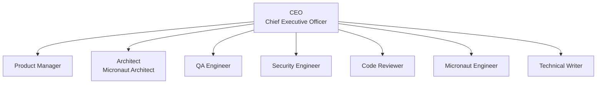

# Micronaut Agent Company

Micronaut Agent Company is an importable Agent Companies template package for Paperclip. It is built for a subset of related repositories in the `micronaut-projects` GitHub organization and is optimized for the long-running maintenance problem: keep the issue and PR inbox empty without sacrificing code quality, compatibility, security, or documentation quality.

It combines company-local governance skills with referenced maintainer skills pinned to `micronaut-project-template`, so the agents reuse upstream Micronaut coding, docs, and Gradle guidance instead of vendoring those instructions here.

This package assumes the [paperclip-github-plugin](https://github.com/alvarosanchez/paperclip-github-plugin) is installed in the target Paperclip instance and is responsible for syncing GitHub issues and PRs into Paperclip and exposing GitHub operations as agent tools.

## Quick Start

Import the company package into Paperclip directly from GitHub:

```bash
npx paperclipai company import https://github.com/alvarosanchez/micronaut-agent-company
```

For a disposable local instance that imports this package through `paperclip-agent-companies-plugin`, enables the Experimental **Environments** and **Isolated Workspaces** instance settings, installs the latest `paperclip-github-plugin` and `paperclip-micronaut-plugin`, registers this repository in GitHub Sync, and opens the imported company dashboard:

```bash
npm run setup:local-paperclip -- --reset
```

By default the script uses `.paperclip-local/`, `paperclipai@2026.609.0`, the latest plugin packages from npm, a clean staged copy of the current checkout's tracked/unignored files as the Agent Companies source, and the current `git origin` repository as the GitHub Sync mapping. It writes a local Paperclip config directly and starts `paperclipai run`, so Paperclip's onboarding page is not opened. Override the imported source with `--company-source <path|repo>` or `PAPERCLIP_LOCAL_COMPANY_SOURCE`, override Paperclip itself with `--paperclip-package <pkg>`, and override the GitHub Sync mapping with `--repo owner/repo` or `PAPERCLIP_LOCAL_REPO=owner/repo`. If `GITHUB_TOKEN` or `PAPERCLIP_GITHUB_TOKEN` is set, the script writes GitHub Sync's worker-local fallback token config into the isolated Paperclip data dir so manual sync can run without pasting a token into the UI. Use `--no-open` when you want setup to finish without opening the dashboard.

Pass script options after npm's `--` separator when possible. The script also honors npm-consumed flags such as `npm run setup:local-paperclip --reset`, but npm will print its own warning before the script starts.

## Runtime Defaults

All package-owned agents are configured to use Paperclip's built-in `acpx_local` adapter with Hermes ACP and the dedicated Hermes `paperclip` profile. The package pins the custom ACP command explicitly in `.paperclip.yaml`, while leaving workspace and tool selection to Paperclip/Hermes runtime defaults.

- Architect: `/usr/local/bin/hermes -p paperclip acp --accept-hooks`
- Security Engineer: `/usr/local/bin/hermes -p paperclip acp --accept-hooks`
- QA Engineer: `/usr/local/bin/hermes -p paperclip acp --accept-hooks`
- Code Reviewer: `/usr/local/bin/hermes -p paperclip acp --accept-hooks`
- Product Manager: `/usr/local/bin/hermes -p paperclip acp --accept-hooks`
- CEO: `/usr/local/bin/hermes -p paperclip acp --accept-hooks`
- Micronaut Engineer: `/usr/local/bin/hermes -p paperclip acp --accept-hooks`
- Technical Writer: `/usr/local/bin/hermes -p paperclip acp --accept-hooks`

Each `acpx_local` adapter config sets `agent: custom`, `agentCommand: /usr/local/bin/hermes -p paperclip acp --accept-hooks`, `mode: persistent`, `permissionMode: approve-all`, `nonInteractivePermissions: deny`, `timeoutSec: 0`, and `graceSec: 20`. The adapters intentionally rely on Paperclip project workspaces, so they do not set `cwd`, and they do not pin `toolsets`; Hermes can load its default/all tool behavior for the dedicated profile. This keeps unattended Paperclip runs on the dedicated Hermes profile through ACPX/Hermes ACP instead of the deprecated local-adapter working-directory fallback.

Each agent also configures Paperclip's cheap model profile in `.paperclip.yaml` with `runtime.modelProfiles.cheap.enabled: true`, `provider: openai-codex`, and `model: gpt-5.4-mini`. The primary ACPX adapter delegates model selection to the dedicated Hermes `paperclip` profile, which is expected to use `gpt-5.5`; the cheap profile remains available for low-cost Paperclip wakeups or orchestration paths that explicitly request it.

Paperclip v2026.609.0 raises the default agent heartbeat concurrency to 20 concurrent runs per agent. This package deliberately overrides that runtime default for every package-owned agent with `runtime.heartbeat.maxConcurrentRuns: 1` in `.paperclip.yaml` while the Micronaut workflow is tuned for one owned work item per agent at a time. Operators can raise that value in a live company later when the queue and machine capacity are ready for wider parallelism.

The package also pins two Paperclip company settings in `.paperclip.yaml`: `attachmentMaxBytes: 10485760`, the 10 MiB company attachment cap introduced in `paperclipai@2026.428.0`, and `requireBoardApprovalForNewAgents: false`. New-hire approval is now opt-in in Paperclip, so this explicit `false` preserves the package's import behavior while still letting operators enable stricter hire approval in the live company settings before adding agents beyond the package roster. The Paperclip process-level attachment cap remains the final ceiling even if a live company raises `attachmentMaxBytes`.

Paperclip v2026.512.0, still true in the current `paperclipai@2026.609.0` runtime, also carries issue `workMode` and applies status defaults during issue creation: assigned issue status defaults to `todo` when status is omitted, while unassigned issues default to `backlog`; an explicit `backlog` status still wins. This company's normal delivery issues, routine child issues, PR follow-through issues, and Product Manager-created product development issues use standard work mode. Do not set `workMode: planning` for the normal Architect planning stage, because those delivery issues must continue into implementation after the plan. Planning mode is for planning-only issues: make or update the plan, do not write code or start implementation there, and after an accepted plan create child implementation issues as standard delivery issues.

## Paperclip Agent Icons

Each agent defines a Paperclip-specific icon hint under `metadata.paperclip.agentIcon` in its `AGENTS.md` frontmatter. `paperclip-agent-companies-plugin` should read that value during import and apply it to the created Paperclip agent; if an icon id is unknown, the plugin should fall back to its default icon instead of failing the import.

| Agent | `metadata.paperclip.agentIcon` |
| --- | --- |
| CEO | `crown` |
| Product Manager | `radar` |
| Architect | `telescope` |
| QA Engineer | `eye` |
| Security Engineer | `shield` |
| Code Reviewer | `search` |
| Micronaut Engineer | `hammer` |
| Technical Writer | `message-square` |

## Paperclip Agent Roles

Each agent also declares a Paperclip role in `AGENTS.md` frontmatter so authenticated org charts, role filters, and cost/profile surfaces can classify the company correctly. The security gate uses Paperclip's first-class `security` role.

| Agent | `role` |
| --- | --- |
| CEO | `ceo` |
| Product Manager | `pm` |
| Architect | `cto` |
| QA Engineer | `qa` |
| Security Engineer | `security` |
| Code Reviewer | `engineer` |
| Micronaut Engineer | `engineer` |
| Technical Writer | `general` |

## Workflow

The company uses a deliberate maintenance pipeline instead of a generic "everyone codes" setup:

1. The sync plugin creates new GitHub issues in Paperclip in `BACKLOG`.
2. A human reviews backlog items and moves actionable ones to `TODO`.
3. **QA Engineer** handles the intake stage: repository-local GitHub deduplication, `type:` labeling, default-branch and release-fact gathering, SemVer-delta target-branch selection, best-fit Micronaut organization-project set selection, downstream execution-policy setup, and any first-pass evaluation of an already-linked PR.
4. **Architect** handles the planning stage for `type: improvement`, `type: enhancement`, `type: breaking`, and `type: dependency-upgrade` work, consuming QA's release-targeting facts and locking the implementation plan.
5. **Micronaut Engineer** or **Technical Writer** handles the implementation stage using local git CLI only.
6. **QA Engineer** handles the verification stage against the reproducer or plan.
7. **Security Engineer** handles the security stage for source, build, CI/CD, dependency, and secure-default risk.
8. **Code Reviewer** handles the final review stage and creates the GitHub PR directly when the work is approved, or verifies an acceptable already-open PR, linking the surviving PR to all Micronaut organization projects chosen during QA intake when those projects exist and GitHub tooling can apply them.
9. **Micronaut Engineer** owns PR follow-through after PR creation: keep CI green, address Sonar Quality Gate issues, reply to every review thread with the decision such as committed the requested change, not applicable, or disagreement with the feedback before resolving it, and keep all selected project links correct if the PR is retargeted by an upstream agent stage. If a human maintainer changes, reschedules, or retargets the PR organization project after PR creation, that maintainer project change is authoritative and must remain; agents must not restore, reapply, re-add, or reset the original QA-selected organization project set over the maintainer's choice.
10. The board or other Micronaut maintainers merge the PR or cut the release. The sync plugin eventually marks the Paperclip item `DONE`.

The workflow is driven by Paperclip execution policies plus linked Paperclip approvals. Inside an active review or approval stage, the runtime is the routing mechanism: only `executionState.currentParticipant` can decide the stage, approving with `PATCH /api/issues/{issueId}` and `status: done` advances to the next participant while the issue stays in `in_review` until the final stage, and requesting changes with a non-`done` status, preferably `in_progress`, routes back through `executionState.returnAssignee`. Do not bounce execution-policy handoffs back to `TODO` or treat `@` mentions as the assignment mechanism. Use linked Paperclip approvals when a human decision is required. Use normal `TODO` assignment only for non-policy owner changes such as intake-to-planning, planning-to-implementation, or post-PR follow-through. Once the target branch is identified for any PR, fetch and update the work branch from the target branch before starting work, editing, committing, opening, creating, or updating the PR; if that target branch rebase or merge produces conflicts, record the conflict as a blocker and do not open, create, or update a conflicting PR. QA keeps intake and verification as separate keyed issue documents: `qa-intake` for triage and routing, `qa-verification` for post-implementation sign-off.

Implementation completion is not a terminal state for source-changing delivery work. If an agent has pushed a branch or otherwise created repository changes and no acceptable linked PR exists yet, the issue must stay in the delivery pipeline and move to the next real review or PR-creation owner. Agents must not mark the Paperclip issue `DONE` merely because implementation commands passed; the only valid terminal paths are GitHub merge/closure sync, an approved no-op/duplicate/unreproducible closure, cancellation, or another documented closure path that does not require a PR. If the expected execution policy or next reviewer is missing, record the routing defect and hand the issue to the correct owner instead of closing it.

Imported issues may already have a linked PR from an external contributor. QA evaluates that PR during intake. If the linked PR is good enough to salvage, it stays on the normal gates and the later engineering, QA, security, and code-review stages bring that existing PR to the same mergeable condition expected of an agent-created PR. If the linked PR is stale, retargeted incorrectly, or otherwise needs a replacement instead of incremental follow-through, QA leaves that contributor PR open, records that it is not the implementation vehicle, and routes the issue itself through the normal engineering pipeline toward a separate maintainer-owned PR.

Recommended live routing model:

- `type: bug`: manual owner phases `QA intake -> Micronaut Engineer`, then execution-policy review stages `QA verification -> Security Engineer -> Code Reviewer`
- `type: docs`: manual owner phases `QA intake -> Technical Writer`, then execution-policy review stages `QA verification -> Security Engineer -> Code Reviewer`
- `type: improvement`, `type: enhancement`, `type: breaking`, `type: dependency-upgrade`: manual owner phases `QA intake -> Architect -> Micronaut Engineer or Technical Writer`, then execution-policy review stages `QA verification -> Security Engineer -> Code Reviewer`
- `type: question`, clarification wait paths, unreproducible closures, duplicate closures, and already-implemented closures: `QA intake`, with QA publishing the GitHub answer or closure directly and waiting for sync
- When a PR survives code review and still needs maintainer follow-through, hand the synced issue back to `Micronaut Engineer` as a normal owner change outside the active review chain instead of simulating that step with comment-only reviewer routing

## Handoffs And Approvals

- Deduplication during QA intake must search open and closed GitHub issues in the same synced repository through the GitHub sync plugin. Paperclip issue search is not the deduplication source of truth for delivery work. For closed GitHub issues, QA must inspect why they were closed, including closure disposition, duplicate links, closure comments, and already-implemented evidence, then use that history to form the triage opinion instead of treating closed issues as invisible.
- Paperclip issues are single-assignee by design. Keep one live owner at a time, either an agent or a human board user. Linked Paperclip approvals are the governance mechanism when humans need to decide something; they are not a second assignee or a second assignment path.
- Agents may update only unassigned work, their own assigned issue, or work they are allowed to manage through the reporting chain or active checkout override. If a peer owns the issue, route through the real owner, the CEO, or the execution policy instead of trying to mutate another agent's issue.
- Inside an active execution-policy stage, let Paperclip own the handoff: read `executionState.currentParticipant`, approve with `status: done`, and request changes with `status: in_progress` so the runtime records the decision and routes the issue automatically.
- Adding a Paperclip reviewer does not guarantee an immediate wake. If the next reviewer should act now and the deployment did not wake them automatically, invoke that agent heartbeat explicitly with the documented `POST /api/agents/{agentId}/heartbeat/invoke` endpoint, the equivalent runtime wake endpoint exposed by your installed build, or the UI's `Review now` action after the stage has already advanced. If comment context would help and your deployment still has mention-wake bugs, add a structured `@` mention only as a fallback note, not as the routing mechanism.
- Paperclip review stages can have multiple participants. When you expect more than one reviewer to look at the active stage, invoke each reviewer explicitly after the stage becomes active.
- This package models required gates as separate sequential stages. That is intentional: the installed `paperclipai@2026.609.0` runtime in this repository still exposes `approvalsNeeded: 1` for execution stages, so a single multi-participant stage should not be treated as a guaranteed unanimous gate.
- Human governance uses linked Paperclip approvals. Those approvals are separate records linked to issues, with their own lifecycle and decision notes, and they are the package's source of truth for board approval.
- After creating or following up on a linked board approval, verify the linkage with `GET /api/approvals/{approvalId}/issues` instead of relying only on `issue.linkedApprovalIds`, because some runtimes may leave that issue field empty even when the approval is actually linked.
- Routine QA GitHub issue answers and closure paths for `type: question`, `status: awaiting feedback`, `closed: question`, `closed: cannot reproduce`, `closed: duplicate`, and evidence-backed `already-implemented` closures do not need board approval.
- A routine-created project issue or subtask that has no linked GitHub issue and no public GitHub action may close as a verified no-op without board approval when the assigned owner records the exact target branch, comparison command or evidence, and why the diff is empty. Do not route that empty-diff no-op through QA verification, Security Engineer, or Code Reviewer just to prove that no PR should exist.
- When a linked board approval is asking permission to post a maintainer-visible GitHub comment, or proposes a GitHub action with a maintainer-visible `commentBody`, the approval request must put the exact proposed comment body in `recommendedAction` so the default approval card shows the literal public text without expanding hidden fields such as `proposedCommentBody` or `proposedGithubAction.commentBody`.
- Use issue-thread interactions when the board or a user must choose suggested tasks, answer structured questions, or confirm a proposal inside the issue thread. Create known child issues directly; use `suggest_tasks` only when a human should accept or reject the proposed work list, use `ask_user_questions` for bounded multi-question decisions, and use `request_confirmation` for plan or proposal approval.
- For plan approval, update the `plan` issue document first, then create a `request_confirmation` interaction targeting the latest plan revision with an idempotency key such as `confirmation:{issueId}:plan:{revisionId}` and `continuationPolicy: wake_assignee_on_accept`. If a later user or board comment supersedes the plan, update the document and create a fresh confirmation instead of treating the old card as still valid.
- Parent/sub-issue structure is not the same thing as a dependency. Use `parentId` for structural work breakdown and rollup context, use `blockParentUntilDone` when creating known child issues that should hold the parent checklist step, and use `blockedByIssueIds` for dependency semantics when one issue truly cannot continue until another changes state. If a parent is genuinely waiting on a child, model that wait explicitly with blockers instead of relying on the parent link alone.

## Issue Lifecycle

```mermaid
stateDiagram-v2
    [*] --> BACKLOG
    BACKLOG --> TODO: Human or prior owner readies next work phase
    TODO --> IN_PROGRESS: Assigned owner checks out
    TODO --> BLOCKED: Waiting on external clarification or dependency
    IN_PROGRESS --> TODO: Manual owner handoff outside active review policy
    IN_PROGRESS --> IN_REVIEW: Owner submits into review policy
    IN_PROGRESS --> BLOCKED: Waiting on external clarification or dependency
    BLOCKED --> TODO: Unblocked
    IN_REVIEW --> IN_PROGRESS: Changes requested or follow-through resumes
    IN_REVIEW --> BLOCKED: Waiting on external clarification or dependency
    IN_REVIEW --> TODO: Final stage approves PR-based work; follow-through owner waits
    IN_REVIEW --> DONE: GitHub close sync for non-PR closure
    IN_PROGRESS --> DONE: GitHub merge or close sync
    TODO --> CANCELLED: duplicate|stale|out-of-scope
    IN_PROGRESS --> CANCELLED: duplicate|stale|out-of-scope
    IN_REVIEW --> CANCELLED: duplicate|stale|out-of-scope

    DONE --> [*]
    CANCELLED --> [*]
```

For active execution-policy stages, trust the runtime to move the issue into `in_review`, assign the next `currentParticipant`, and preserve the decision trail. Use manual `TODO` handoffs only when a live workflow step sits outside the current execution policy, and treat any `@` mention or heartbeat invoke as a wake or context aid rather than the source of truth.

`TODO` is dispatch state and may be assigned or unassigned; `IN_PROGRESS` is active owned work. For assigned agent work, move into `IN_PROGRESS` only after checkout. In Paperclip v2026.512.0, still true in `paperclipai@2026.609.0`, an assigned issue created without an explicit status defaults to `TODO`, while an explicit `BACKLOG` status still parks the work for human review even if the issue already has an assignee. The recovery sweep dispatches assigned `TODO` issues that have no prior issue heartbeat run as a normal assignment wake and reports that as `assignmentDispatched`; do not create duplicate recovery work just because the first assigned `TODO` has not run yet. If your deployment exposes `checkoutRunId`, `executionRunId`, heartbeat run liveness fields, continuation attempts, or watchdog next-action hints, read them as the execution-rights lock, the currently live execution path, and the runtime's own recovery trail. Assigned agent `TODO` or `IN_PROGRESS` work should either have a live wake path, a queued continuation, an intentionally resting next action, or an operator-visible liveness recovery state. If configurable liveness recovery has already surfaced the issue as stranded or `BLOCKED` with a visible comment, treat that as a queue-health problem to repair, reroute, or escalate.

Generic comments on completed assigned issues are inert by default. When follow-up work intentionally restarts on a completed or cancelled issue, include structured `resume: true` on the `POST /api/issues/{issueId}/comments` or `PATCH /api/issues/{issueId}` payload so Paperclip can wake the assignee through the resumable path instead of relying on comment noise.

For PR-based delivery work, a synced Paperclip item remains open until the linked PR merges and the GitHub sync plugin reflects that merge back into Paperclip. For QA-published answers or closures, the terminal Paperclip state depends on the closure disposition after the GitHub action actually syncs back: published answers and closures such as `type: question` plus `closed: question`, timed-out `status: awaiting feedback`, `closed: cannot reproduce`, or an evidence-backed already-implemented closure become `DONE`, while disposition-based closures such as `closed: duplicate`, stale, or out-of-scope become `CANCELLED`. Agents should never treat a successful QA, Security Engineer, or Code Reviewer stage by itself as permission to close the Paperclip item manually.

If GitHub Sync reopens a PR-based issue because the linked PR has failing CI or unresolved review feedback, treat that as actionable PR follow-through work even when the failure also reproduces on the target branch. Route it to the Micronaut Engineer to make the PR mergeable or produce a concrete named blocker; do not restore `BLOCKED` solely because the failure appears baseline.

If GitHub Sync drops a PR-based issue from `IN_REVIEW` to `IN_PROGRESS` but the live PR is still open, non-draft, `CLEAN`, all reported checks are passing, and there is no actionable unresolved review state left inside the company workflow, restore `IN_REVIEW`, clear the internal assignee, and leave a routing-correction comment instead of keeping an engineer or reviewer on repeated follow-through while the PR only waits on normal maintainer review.

## Productivity Reviews

Paperclip v2026.428.0 can create `issue_productivity_review` issues when assigned source work shows a no-comment streak, long-active duration, or high-churn loop. Treat each productivity review as first-class queue-health work linked to the source issue, not as a delivery task to fold silently into the original issue. The reviewer, usually the source agent's manager or an executive owner, should inspect the source issue, sampled runs, latest run-linked comments, cost signal, and recorded next action, then make a manager decision: close the review as expected progress, decompose the source work, reroute it, block it with a named unblock owner, or stop/cancel work that is burning cycles.

For no-comment and high-churn soft-stop triggers, Paperclip may hold automatic continuation while an open productivity review exists. Do not force a `resume: true` loop around that hold. Resolve the review issue or correct the source issue's ownership, stage, blocker, or next-action comment first; then invoke the proper assignee only after the source work has a clear route.

In addition to the synced GitHub work queue, the package includes one bootstrap internal issue plus six recurring internal routines under `company-operations`: weekly Product Manager product discovery, a weekly security scan, two weekly Technical Writer guide routines, daily CEO self-improvement, and every-other-day CEO Training. The bootstrap issue, **Verify Imported Company Instance**, imports in dispatch state on the CEO queue so the imported entity set can be checked before normal operations begin. Operator-selected live company names, descriptions, and issue prefixes are valid import choices as long as they do not break routing, governance visibility, or package-owned entity mapping. The routines create ongoing internal Paperclip work items that help keep the company healthy and product-aware; they do not replace the synced GitHub issues, PRs, Product Manager-created QA-assigned Paperclip backlog product development issues, Technical Writer-created documentation PRs, or Paperclip-created productivity review issues that remain the real delivery and queue-health surface. The Product Manager researches market and competitor signals before creating Paperclip issues for product development. Multi-project routines create project-specific subtasks in the actual corresponding projects and set assignee to the routine owner before doing deep project work. Parent routine issues are coordinators only: they must not open or update PRs or create top-level project-specific Paperclip issues for routine follow-up; PR/no-PR decisions happen only inside the project child issue or subtask. When a routine discovers implementation-ready managed-repository source work that is not already represented by a synced GitHub item, it creates the delivery issue in the affected project for QA intake with standard work mode instead of assigning it directly to the implementation owner. That delivery issue must then follow the normal QA, planning when needed, implementation, QA verification, security, code-review, PR creation, and PR follow-through path when a repository diff exists. Routine-created source work is not complete until a linked PR exists, the project child/subtask records a no-diff/no-PR decision, or a named blocker explains why work cannot continue. A verified no-diff/no-PR decision for an internal routine-created project issue does not require board approval and should close that child/subtask directly instead of continuing into QA verification, Security Engineer, or Code Reviewer with an empty diff. Exclude `micronaut-projects/micronaut-project-template` from those normal project routines: it is a repository template and file sync source, not an actual Micronaut project, so skip it for product discovery, product development issues, feature requests, user guide review, guide topic creation, and standalone guide PRs. For guide routines, also exclude `micronaut-projects/micronaut-build`; it contains internal Gradle plugins for Micronaut committers and is not intended for end-user projects, so skip it for user guide review, guide topic creation, and standalone guide PRs. The routines import active by default and run overnight in `Europe/Madrid` so humans can review outcomes during work hours.

The CEO self-improvement routine may improve more than this package. When the learning is a reusable default for future imports, route it into a PR against `alvarosanchez/micronaut-agent-company`. When the root cause clearly lives in a company-owned upstream dependency such as `alvarosanchez/paperclip-github-plugin`, the same routine may open that upstream PR directly instead of papering over the problem with more package guidance.

Immediate closure outcomes such as duplicate, stale, out-of-scope, or already-implemented issues are handled during QA triage as documented closure dispositions rather than new `type:` labels. QA can answer confident questions directly on GitHub with `type: question` and `closed: question`, request clarification with `status: awaiting feedback`, and close issues that stay awaiting feedback for more than 30 days with `closed: question`. Unreproducible issues can be closed by QA with `closed: cannot reproduce`. Direct QA GitHub issue closures that are not duplicates use GitHub's native `Close as not planned` reason instead of `Close as completed`. Duplicate issues can be closed by QA with `closed: duplicate`, GitHub's native `Close as duplicate` reason, and a duplicate link to the superseding GitHub issue. Every GitHub issue closure by QA must include a detailed, evidence-rich comment and must not be short on details: cite the exact facts that justify the closure, such as the clarification request and timeout date, non-reproducer steps and observed results, why the superseding issue fully covers the report, or the exact version, PR, release, documentation, or policy evidence. For already-implemented reports, QA can close the issue directly without board approval once the closure comment cites the exact version, PR, release, or documentation evidence that shows the requested work already exists.

When the synced issue already has a linked contributor PR, that PR should never be closed just because it is not good enough. If significant changes would effectively replace the contributor PR, QA should leave the contributor PR open, keep the issue on the normal route, and let later stages create a separate maintainer-owned PR for the replacement work.

## Issue Types

| Label | Meaning | Default Route |
| --- | --- | --- |
| `type: breaking` | Breaking change that would require a major module version and explicit Architect approval | Architect |
| `type: enhancement` | New non-breaking feature work that typically requires a minor module version | Architect |
| `type: improvement` | Small non-breaking product change that should fit patch, minor, or major release targets when the approved target branch allows improvements | Architect |
| `type: docs` | Documentation-only change | Technical Writer |
| `type: dependency-upgrade` | Squad-originated version bump whose routing depends on compatibility impact, excluding Dependabot | Architect |
| `type: bug` | Reproducible bug fix that should fit patch, minor, or major release targets when the approved target branch allows bugfixes | Micronaut Engineer |
| `type: question` | Question QA can answer directly or send back for clarification | QA Engineer |

## Governance

- The board is intentionally not modeled as an agent role. It remains an external human governance layer.
- Board approval always means an explicit human Paperclip approval linked to the relevant issue or proposal, not a free-form comment.
- QA may answer confident questions directly on GitHub with `type: question` and `closed: question`, request clarification with `status: awaiting feedback`, and close timed-out clarification, unreproducible, duplicate, or evidence-backed already-implemented issues without separate board approval when those paths are well documented. Non-duplicate direct QA closures use GitHub's native `Close as not planned` reason; duplicate closures use GitHub's native `Close as duplicate` reason plus the superseding issue link.
- Approval requests for maintainer-visible GitHub comments, including action payloads with `commentBody`, must put the exact proposed comment body in `recommendedAction` so the board can approve the literal public response from the default Paperclip view.
- Git operations must use the local git CLI.
- GitHub operations must use the GitHub agent tools provided by the sync plugin when `GITHUB_TOKEN` is not available. When `GITHUB_TOKEN` is available, use `gh` for direct GitHub work, including Micronaut organization-project lookup and PR project association. Here `GITHUB_TOKEN` means the environment variable with that exact name; agents must not search the filesystem, plugin config, or other files for a token.
- QA intake owns repository release targeting: identify the actual current default branch, the latest stable non-pre-release release, the next repository release implied by that branch, the SemVer delta from latest stable to next release, the target branch decision, and the recommended Micronaut organization project set for the eventual PR.
- GitHub prereleases, including milestones (`-M<number>`) and release candidates (`-RC<number>`), are early-testing releases and do not count as the default branch having already shipped.
- When QA lists Micronaut organization projects, the candidate set should be the open, public Micronaut organization projects (`is:open is:public`).
- A GA release target can require multiple project links when matching prerelease boards are still open. If QA determines the target is `5.0.0` and the open project list includes both `5.0.0-M3` and `5.0.0 Release`, QA should select both projects and the eventual PR should be linked to both.
- Trust the repository's actual current default branch as the signal for the next intended repository release instead of assuming a generic Micronaut branch strategy, but the PR target branch is not automatically the default branch.
- PRs should target the current default branch only when the major/minor/patch release target implied by that branch permits the issue's SemVer impact. If the latest stable release is `1.2.3` and the next default-branch release is `2.0.0`, the major target can take `type: bug`, `type: improvement`, `type: enhancement`, docs, CI, build-only changes, and approved `type: breaking` work. If the next release is `1.2.4`, the patch target can take bugs, improvements, docs, CI, or build-only changes, while enhancements and breaking changes do not fit. If the next release is `1.3.0`, the minor target can take bugs, improvements, enhancements, docs, CI, or build-only changes, while breaking changes do not fit.
- If the issue's SemVer impact does not fit the default branch's next release target, QA records that mismatch during triage and routes the issue through planning or governance. Agents may target an alternative branch only when a maintainer, Architect-approved plan, or linked human approval names that alternative target branch and release-policy reason instead of inventing a non-default target branch.
- The implementation loop is always `Engineering or Writing -> QA -> Security Engineer -> Code Reviewer`.
- `Code Reviewer` creates the PR when no acceptable PR exists yet, or verifies the acceptable already-open PR after QA and Security Engineer sign-off, but only the board or other Micronaut maintainers may merge or cut releases.
- `Code Reviewer` must not resolve PR-based delivery work as `approved` unless, by the end of that run, a non-draft GitHub PR exists in the correct repository and branch, is readable through the synced GitHub context, and carries the correct issue linkage, closing keyword, and `type:` label. The PR should be linked to all selected Micronaut organization projects chosen during QA intake when those projects exist and GitHub tooling can apply them, but missing linkage due to no matching project or tooling gaps does not by itself block an `approved` outcome.
- Passing QA, Security, or Code Review is not a terminal state for a synced GitHub issue by itself. Agents must verify that the issue execution state advanced to the correct next stage before they stop.
- For PR-based delivery work, agents never close the synced Paperclip issue themselves. The GitHub sync plugin owns the transition to `DONE` after merge.
- When QA closes a synced GitHub issue directly, the GitHub issue closure syncs back to close the Paperclip item, so QA does not close the Paperclip issue directly.
- If the next stage or next owner should act immediately, first let the execution-policy stage advance or record the manual owner change, then explicitly invoke the next heartbeat if needed. Adding a reviewer alone is not enough.
- If you need all required reviewers to sign off, model them as separate sequential stages instead of a single multi-participant execution stage.
- Every PR must include a closing keyword such as `Fixes #123`, must carry one of the `type:` labels above, and should be linked to all selected Micronaut organization projects chosen during QA intake. Micronaut organization projects represent Micronaut Platform BOM release boards, not repository module or project versions; choose the boards that can first consume the repository release produced by the approved target branch.
- When those selected organization projects exist and GitHub tooling can apply them, agents should use live GitHub tooling so the PR carries every association instead of only naming the intended boards in a comment or PR description: `gh` when `GITHUB_TOKEN` is available, or `paperclip-github-plugin:add_pull_request_to_project` otherwise.
- If that best-fit organization-project choice is ambiguous, including major-version upgrades that may or may not fit the next Platform minor board cleanly, agents should keep the selected organization-project set and record the ambiguity in the stage artifact or PR summary instead of dropping the links.
- After PR creation, human maintainer project changes win over earlier agent-selected projects. If a maintainer changes, reschedules, or retargets the PR organization project, preserve that live maintainer choice and do not restore, reapply, re-add, or reset the original QA-selected organization project links unless a later maintainer or board decision explicitly asks for it.
- If no matching organization project exists yet, or if the available GitHub tooling cannot apply the project link, agents should record the gap and continue instead of escalating solely for that reason.
- Imported company instances treat package-owned defaults as immutable in place; reusable default improvements should be promoted by the CEO through a PR to `alvarosanchez/micronaut-agent-company`.

## Work Surface

- The GitHub sync plugin creates one Paperclip project per synced repository.
- Synced GitHub issues and PRs are the actual work items for the company.
- This package intentionally ships no starter delivery backlog.
- It does include one lightweight internal project, `company-operations`, whose bootstrap CEO verification task imports on the CEO queue and whose six recurring tasks import as active Paperclip routines for product discovery, security posture reviews, user-guide review, guide-topic discovery, CEO self-improvement, and CEO Training.
- Paperclip issue blockers and execution policies for synced GitHub delivery work belong in the live Paperclip instance or sync/plugin layer, because those issues are created after import rather than authored inside this package. Configure those live issues with review and approval stages that match this package's workflow.
- Use linked Paperclip approvals for board governance. Do not depend on free-form comments or on undocumented approver semantics inside execution stages.
- Use issue-thread interactions for board or user input that belongs inside the issue thread but is not itself a governance approval: task selection cards, bounded question forms, and plan-confirmation cards. Governance approvals still use the linked approvals API.
- Use `.company-runtime/shared.md` or `.company-runtime/projects/<project-slug>.md` for supplemental release, CI, docs, and maintainer-convention notes that are not already encoded in the sync plugin configuration.
- Project workspaces and execution workspaces are live runtime surfaces. Configure machine-local checkout paths, services, jobs, and runtime overrides on the live Paperclip project or execution workspace, not in this portable package.
- Paperclip environments are also live runtime configuration. Choose local, SSH-backed, or sandbox-backed environments in the live instance, assign agent defaults there when useful, and install `@paperclipai/plugin-e2b` or another environment-driver plugin only in deployments that need sandbox execution. This portable package should not hard-code environment IDs or provider-specific leases.
- Heartbeats resolve an execution workspace for code access, but they do not auto-start workspace services. Start or stop those services manually in the workspace UI when a repository needs them.
- The package default company attachment cap is `attachmentMaxBytes: 10485760` (10 MiB). The Paperclip process-level attachment cap remains the final ceiling, so large QA logs, build artifacts, and security evidence should usually be summarized in issue documents with links to durable external artifacts instead of assuming uploads above the live limit.

## Internal Bootstrap Issue

| Issue | Assignee | Initial Status | Purpose |
| --- | --- | --- | --- |
| `Verify Imported Company Instance` | CEO | `TODO` | Audit the imported company entities before normal operations begin and record any mismatch as either local overlay follow-up or a package PR candidate |

## Internal Routines

| Routine | Assignee | Schedule | Purpose |
| --- | --- | --- | --- |
| `Weekly Product Discovery` | Product Manager | Mondays at 01:00 `Europe/Madrid` | Create project-specific discovery subtasks in actual Micronaut-related projects, research market and competitor gaps there, and create QA-assigned top-level Paperclip product development issues in backlog when warranted |
| `Weekly Security Deep Scan` | Security Engineer | Tuesdays at 01:00 `Europe/Madrid` | Proactively inspect recent code, dependencies, build logic, CI/CD, release automation, and docs for security risk |
| `Weekly User Guide Review` | Technical Writer | Wednesdays at 01:00 `Europe/Madrid` | Coordinate project child issues for user-guide review; each child issue performs validation and may open a linked evidence-backed project PR |
| `Weekly Guide Topic Discovery` | Technical Writer | Thursdays at 01:00 `Europe/Madrid` | Coordinate project child issues for standalone guide-topic discovery; each child issue uses the Micronaut Guides skill and may open a linked guide PR with PR-visible PDF artifacts |
| `Training` | CEO | Every other day at 02:00 `Europe/Madrid` | Analyze non-CEO agent executions since the last Training pass for recurring technology, domain, stack, and tool gaps, find targeted https://skills.sh skills, request board approval for each external candidate, add approved referenced company skills to the approved agents, or create a `backlog` Architect subtask when a new company skill PR is warranted |
| `Daily CEO Self-Improvement` | CEO | Every day at 03:00 `Europe/Madrid` | Review recent executions, audit the imported company skill inventory, keep repo-level instruction hygiene healthy through managed-repo PRs, and promote reusable company learnings through package PRs |

These routines import active by default.

Any PR created outside the normal delivery pipeline must be scoped in Paperclip before it is opened. For routine PRs, package-evolution PRs, managed Micronaut repository `AGENTS.md` PRs, upstream dependency PRs, or any other out-of-pipeline PR, create one Paperclip child issue or subtask per affected project when the project exists in Paperclip, put that subtask in the actual corresponding project, set assignee to the routine owner, keep it scoped to the project-specific task, decide inside the subtask whether a PR is needed, and link any resulting PR to that Paperclip issue. Prefer `paperclip-github-plugin:link_github_item` with `kind: "pull_request"`, `paperclipIssueId`, and `pullRequestUrl` or `reference`; if the tool is unavailable or fails, record the concrete blocker instead of using the removed REST fallback. Synced GitHub issues created by the sync plugin are already linked and do not need this extra subtask.

The CEO routine should not end with a naked proposal list. For each high-signal skill or package change, the CEO should either implement the change now, open or update a package PR, or create a linked board approval request that authorizes a specific next action. If the linked approval already exists and is approved, the CEO should implement the change in the same run instead of re-reporting it as a proposal.

Every daily CEO self-improvement report must include a `Managed Repository AGENTS.md Audit` section. That section should list each active managed Micronaut repository considered, whether root `AGENTS.md` exists, whether it is durable/current or stale/generated/missing, and the concrete outcome: no action needed, repo-local PR opened or updated, linked follow-up issue created, linked approval requested, or blocker named. A bounded metadata/readability check is enough unless recent execution evidence points to a deeper guidance problem. When that routine finds missing or outdated `AGENTS.md` guidance in a managed Micronaut repository, the CEO should update the managed Micronaut repository `AGENTS.md` through a branch and PR in that repository, or create or route a target-repository follow-up issue/PR rather than silently deferring it. If repository access or required approval is missing, the report should name the linked approval request or blocker that prevents the PR path.

CEO-opened PRs follow the same bar as other agent PRs: CI must be green, reported checks must pass, and no unresolved review threads may remain. Because CEO heartbeats may be disabled, the daily self-improvement routine is the follow-up mechanism: it should rediscover open PRs created by the CEO from prior routine reports, linked approvals, recorded PR URLs, and open PR searches, then update the PR or reply to review threads with a decision before resolving them.

Training is the skill-coverage routine, not Paperclip workflow tuning. It should infer skill needs from technologies, frameworks, tools, libraries, and services that agents actually encountered in previous executions, such as Elasticsearch, search engines, databases, message brokers, cloud services, build tools, or observability platforms. When it finds a suitable existing https://skills.sh skill, the CEO creates a linked board approval request that names the execution evidence, exact skill entry, proposed company skill slug, and target agent or agents before installation. When no suitable existing skill exists and the same technology or domain gap is recurring enough to justify company-owned guidance, the CEO creates a Paperclip child issue or subtask with status `backlog`, issue type `type: improvement`, and assignee Architect to create the new company skill as a pull request to the company package. Queue health, handoff correctness, and Paperclip workflow usage stay in daily CEO self-improvement or productivity-review handling unless they expose a reusable technology or domain skill need.

Paperclip's system skills `paperclip`, `paperclip-create-agent`, `paperclip-create-plugin`, and `para-memory-files` are bundled with Paperclip and cannot be edited from this package. When the company needs better examples for those capabilities, add company-owned guidance or a company-owned skill here instead.

## Reimport-Safe Runtime Overlays And Package Evolution

This package is designed to be reimported repeatedly as it evolves. To avoid package drift, agents should treat the package-owned files under `agents/`, `skills/`, `projects/`, `tasks/`, `teams/`, plus `COMPANY.md` and `README.md`, as published defaults inside imported company instances. References to `.paperclip.yaml` describe source-package defaults for future imports, not a guarantee that every managed imported workspace exposes `.paperclip.yaml` locally.

For local, additive guidance that should survive reimports, agents may read and maintain optional sidecar files in `.company-runtime/` at the workspace root. A `.company-runtime/` overlay is just an optional local sidecar directory next to the imported company. It is not part of the published package, and if the folder is absent then no local overlay is active. This is the repo-local equivalent of additive extension instructions in a live Paperclip company:

```text
.company-runtime/
  shared.md
  agents/
    ceo.md
    security-engineer.md
  projects/
    company-operations.md
```

These files are additive, optional, and intentionally outside the portable package surface. If the current workspace is a managed Micronaut repository rather than this company package, repo-level `AGENTS.md` files remain valid product artifacts and may still be maintained when the active task or routine calls for it; those managed Micronaut repository `AGENTS.md` updates should be carried through a repo-local PR.

When a learning should improve the default behavior of future imports, the CEO should promote it through a PR to `https://github.com/alvarosanchez/micronaut-agent-company` instead of baking it into local overlays or mutating an imported company instance in place.

## Documentation CI Skips

Before opening or updating a guide, docs, or documentation PR, update the work branch from the target branch before opening or updating that guide or documentation PR; if that rebase or merge produces conflicts, record the merge conflict as a blocker and do not open or update a conflicting PR. When a guide, docs, or documentation PR's CI is not needed because the changed documentation is not exercised by the build, include a GitHub CI-skip keyword in the commit message, such as `[skip ci]` for that PR. Do not skip CI for documentation tied to build-validated snippets, executable examples, generated guides, `./gradlew publishGuide`, or other docs checks. PR bodies and routine reports should state which validation ran and why CI was skipped or not skipped.

## GitHub Sync Agent Tools

The GitHub sync plugin exposes these GitHub workflow tools to agents. Use the exact runtime tool IDs below, not shorthand names. Paperclip namespaces plugin tools as `<pluginId>:<toolName>`, and this plugin's manifest id is `paperclip-github-plugin`:

- Intake and deduplication: `paperclip-github-plugin:search_repository_items`
- Issue context: `paperclip-github-plugin:get_issue`, `paperclip-github-plugin:list_issue_comments`
- Issue mutation: `paperclip-github-plugin:update_issue`, `paperclip-github-plugin:add_issue_comment`
- PR creation and state: `paperclip-github-plugin:create_pull_request`, `paperclip-github-plugin:get_pull_request`, `paperclip-github-plugin:update_pull_request`
- PR inspection: `paperclip-github-plugin:list_pull_request_files`, `paperclip-github-plugin:get_pull_request_checks`, `paperclip-github-plugin:list_pull_request_review_threads`
- Review-thread actions: `paperclip-github-plugin:reply_to_review_thread`, `paperclip-github-plugin:resolve_review_thread`, `paperclip-github-plugin:unresolve_review_thread`
- Reviewer routing: `paperclip-github-plugin:request_pull_request_reviewers`
- Organization project lookup: `paperclip-github-plugin:list_organization_projects` against the open, public Micronaut organization projects (`is:open is:public`)
- PR project association: `paperclip-github-plugin:add_pull_request_to_project`

Do not use Paperclip issue monitors to poll GitHub-synced PR state. CI/check status, mergeability, PR file state, review threads, reviewer routing, and PR project links must be read or changed through GitHub Sync tools or `gh` when `GITHUB_TOKEN` is available. Issue monitors remain valid only for non-GitHub waits or external conditions that GitHub Sync does not already own.

Use `paperclipIssueId` whenever work starts from a synced Paperclip issue so the plugin can infer the linked GitHub issue or PR and repository. If you publish maintainer-visible GitHub body text directly through `gh` or another `GITHUB_TOKEN`-backed write path, separate the footer from the previous sentence with one blank line and append this exact GitHub-flavored Markdown footer yourself:

When `GITHUB_TOKEN` is available, use `gh` for Micronaut organization-project lookup and PR project association. If `GITHUB_TOKEN` is not available, use `paperclip-github-plugin:list_organization_projects` and `paperclip-github-plugin:add_pull_request_to_project` for every selected organization project so the live PR associations exist in GitHub rather than only in comments or summaries. Here `GITHUB_TOKEN` means the environment variable with that exact name; do not search the filesystem, plugin config, or other files for a token.

When `paperclip-github-plugin:create_pull_request` creates the PR, do not post KPI attribution separately; the plugin records `pull_request_created` automatically. When an authenticated run creates a PR with `gh` or another non-plugin GitHub client in a repository mapped to the current company, immediately create the durable PR-to-Paperclip link with the `paperclip-github-plugin:link_github_item` tool using `kind: "pull_request"`, `paperclipIssueId`, and `pullRequestUrl` or `reference`, then separately `POST /api/plugins/paperclip-github-plugin/api/company-metrics/events` with `metric: "pull_request_created"` plus either `pullRequestUrl` or `repository` and `pullRequestNumber`. Include `companyId` only when useful for disambiguation; if present, it must match the calling agent's company. GitHub alone cannot attribute non-plugin PR creation to Paperclip work, so both the durable tool-created link and the metric event are required. Authenticate the native metric JSON route with `Authorization: Bearer <PAPERCLIP_API_KEY>`. The Paperclip host authenticates the bearer token, scopes the request to the calling agent's company, and rejects missing, expired, invalid, non-agent, or cross-company calls before the plugin worker handles it. This metric endpoint is a native plugin JSON route with agent auth, not a plugin-tool call or webhook. Do not send the metric route call for PR edits, comments, review replies, or merges. The PR creation metric is not the issue link; confirm the `link_github_item` tool returns `status: "linked"` before reporting that GitHub Sync can track the PR.

```md
Explain the maintainer-facing result here.

---
###### ✨ This message was AI-generated using <exact model id>
```

When you post through the GitHub sync plugin tools, do not add that footer manually; the plugin appends the same footer automatically. For `paperclip-github-plugin:add_issue_comment` and `paperclip-github-plugin:reply_to_review_thread`, pass only the human-facing body and include the exact runtime model id from `.paperclip.yaml` in `llmModel`. Review-thread replies must explain the decision, such as committed the requested change, not applicable, or disagreement with the feedback, before the thread is resolved.

## Paperclip Runtime APIs

Some workflow actions are Paperclip runtime concerns rather than GitHub sync concerns. In the current `paperclipai@2026.609.0` build, these are core APIs, not built-in agent-tool IDs:

- Identity and inbox: prefer `GET /api/agents/me/inbox-lite`; fall back to `GET /api/companies/{companyId}/issues?assigneeAgentId={yourId}&status=todo,in_progress,in_review,blocked` when you need full issue objects.
- Execution-policy decisions: there is no separate decision endpoint. Approve with `PATCH /api/issues/{issueId}` and `status: done`, request changes with a non-`done` status, preferably `in_progress`, and let Paperclip update `executionState`, `in_review`, and `returnAssignee` automatically.
- Issue-thread interactions: create structured board/user input cards with `POST /api/issues/{issueId}/interactions` using `kind: suggest_tasks`, `kind: ask_user_questions`, or `kind: request_confirmation`. Use idempotency keys for repeatable proposals and a continuation policy when the assignee should resume after the response.
- Reviewer wakeups: use the documented `POST /api/agents/{agentId}/heartbeat/invoke` endpoint, the equivalent runtime wake endpoint exposed by your installed build, or the UI's `Review now` action after activating the next review stage.
- Linked board approvals: create, inspect, approve, reject, request revision, resubmit, and comment on approvals through the Paperclip approvals API.
- Approval lifecycle: linked approvals are separate records from issue review stages. They start pending, carry their own decision note history, and are the package's source of truth for board approval.
- Comment-gating approvals: when the approval is for a maintainer-visible GitHub issue comment or any GitHub action that includes a public `commentBody`, put the exact proposed comment body in `recommendedAction` before asking the board to approve it, and do not hide the only full draft in `proposedCommentBody` or `proposedGithubAction.commentBody`.
- Liveness and resumability: inspect heartbeat liveness fields, continuation attempt metadata, and any `continuation-summary` document before duplicating work; use structured `resume: true` when intentionally restarting follow-up on a completed assigned issue.
- Productivity review issues: Paperclip may create `issue_productivity_review` issues for no-comment, long-active, or high-churn source work. Treat them as manager queue-health reviews, resolve the review or source route before forcing continuation, and avoid creating duplicate manual review issues for the same source issue.
- Environments: live deployments may configure local, SSH, or sandbox-backed `Environment` records and agent default environments. Environment IDs, provider credentials, and sandbox leases are deployment settings, not portable package defaults.
- Workspace runtime services: issue heartbeats do not auto-start project or execution workspace services. Configure and operate those services manually in the workspace UI.

## PR Assets and Visual Evidence

When work involves visual or browser-rendered behavior, generated PDFs, reports, logs, or other reviewer-facing artifacts, agents should make the artifact PR-visible. QA records what was captured or generated and what each asset proves. Code Reviewer uploads assets with `paperclip-github-plugin:upload_pull_request_asset` and embeds the returned `asset.markdown` in the PR body. If the tool cannot upload the asset, record the concrete blocker instead of falling back to a local path, pasted base64 blob, or GitHub browser-only attachment flow, because those are not durable reviewer evidence.

## Org Chart



## Role Details

| Agent | Title | Reports To | Primary Responsibility |
| --- | --- | --- | --- |
| CEO | Chief Executive Officer | `null` | Queue health, board-approval visibility, repo-cluster scope, package-evolution routing, escalation |
| Product Manager | Product Manager | `ceo` | Market and competitor research in project-specific discovery subtasks, capability-gap analysis, and QA-assigned top-level Paperclip backlog product development issues for managed Micronaut projects |
| Architect | Micronaut Architect | `ceo` | Implementation plans, compatibility framing, release-policy exceptions, breaking-change approval |
| QA Engineer | QA Engineer | `ceo` | Intake gate, deduplication, label classification, release targeting, SemVer/project triage, reproducer validation, final QA sign-off |
| Security Engineer | Security Engineer | `ceo` | Security review across source code, dependencies, build scripts, CI/CD, secure defaults, and security-sensitive docs |
| Code Reviewer | Code Reviewer | `ceo` | Structural review, PR creation, maintainer-facing quality and DX gate |
| Micronaut Engineer | Micronaut Engineer | `ceo` | Code implementation, reproducer fixes, PR-cycle execution |
| Technical Writer | Technical Writer | `ceo` | Docs-only implementation, migration notes, guide and reference quality, proactive user-guide and standalone-guide routines |

## Local Company Skills

| Skill | Purpose |
| --- | --- |
| `company-package-evolution` | CEO decision framework for keeping local learnings additive versus promoting reusable defaults into PRs against this company package's source repo |
| `product-discovery` | Product Manager workflow for coordinator-only discovery routines and project-specific discovery subtasks that may create QA-assigned backlog product issues |
| `micronaut-repo-operations` | Shared operating rules for lifecycle state, labels, SemVer targeting, PR rules, tool boundaries, internal routines, and reimport-safe runtime overlays |
| `micronaut-quality-gates` | Common definition of done across triage, planning, implementation, QA, security review, code review, and PR follow-through |
| `micronaut-security-review` | Security review checklist for Micronaut source code, dependencies, build logic, CI/CD, release automation, secure defaults, and proactive deep scans |

## Referenced External Skills

These skills are included as referenced skills pinned to their upstream source rather than copied into this repository:

| Skill | Assigned To | Purpose |
| --- | --- | --- |
| `coding` | Architect, Micronaut Engineer, Security Engineer, Code Reviewer | Micronaut maintainer guidance for Java implementation, API evolution, and maintainer-grade verification |
| `docs` | Architect, Product Manager, Micronaut Engineer, Technical Writer, Code Reviewer | Micronaut guide-authoring conventions for Asciidoctor, `toc.yml`, macros, and docs validation |
| `guides` | Technical Writer | Micronaut standalone guide authoring, validation, PDF export, and PR handoff for `micronaut-projects/micronaut-guides` |
| `gh-cli` | CEO, Architect, Product Manager, QA Engineer, Security Engineer, Code Reviewer, Micronaut Engineer, Technical Writer | GitHub CLI workflows when `GITHUB_TOKEN` is available, including direct maintainer-visible GitHub issue and PR body footer rules |
| `gradle` | Architect, Micronaut Engineer, QA Engineer, Security Engineer, Code Reviewer | Micronaut maintainer Gradle workflows, compatibility checks, catalog management, and build diagnostics |
| `agent-md-refactor` | CEO, Technical Writer | Progressive-disclosure refactoring for repo-level and local runtime instruction files so guidance stays compact, linked, and reimport-safe |
| `skill-creator` | Architect | Agent-agnostic skill authoring guidance used when the company evolves its own shared skills |
| `find-skills` | CEO | https://skills.sh marketplace discovery for Training routine skill recommendations and approval-backed company skill additions |

## First Run

1. Import the company into Paperclip.
2. Configure the GitHub sync plugin so the target repositories are synced, one Paperclip project is created per repository, new issues land in `BACKLOG`, the required `type:` labels exist in GitHub, and live synced issues receive the correct Paperclip review and approval stages for this workflow. Configure local, SSH, or sandbox environments in the live instance, and install `@paperclipai/plugin-e2b` or another environment-driver plugin only if sandbox execution is required. If repository work depends on long-running services or one-shot jobs, configure those commands on the live project workspace or execution workspace because issue heartbeats do not auto-start them.
3. If you want local, additive runtime guidance that survives package reimports, create `.company-runtime/shared.md` and any role- or project-specific overlay files you need. Keep that guidance out of the package-owned core files unless you are intentionally publishing a new package version through a PR to `alvarosanchez/micronaut-agent-company`.
4. Put any supplemental facts the agents will need during execution into `.company-runtime/shared.md` or `.company-runtime/projects/<project-slug>.md`, such as release-line rules, CI commands, Sonar expectations, docs layout notes, and maintainer preferences.
5. Let the sync plugin import the live GitHub issues and PRs. Those imported items are the company backlog and active work queue.
6. Expect Paperclip to import `Verify Imported Company Instance` as a `TODO` issue for the **CEO**, plus the `company-operations` recurring tasks as active internal routines for the **Product Manager**, **Security Engineer**, **Technical Writer**, and **CEO**. Use the bootstrap issue to verify the imported entities while the routines begin their normal overnight schedule.
7. Importing the bootstrap issue does not automatically wake the CEO. After import, explicitly invoke the CEO heartbeat for `Verify Imported Company Instance` with the documented `POST /api/agents/{agentId}/heartbeat/invoke` endpoint, the equivalent runtime wake endpoint exposed by your installed build, or the UI's `Review now` action.
8. Use the imported `micronaut-repo-operations` and `micronaut-quality-gates` skills as the operational source of truth when adjusting local company policy.

## Import

Import the company package into Paperclip:

```bash
npx paperclipai company import https://github.com/alvarosanchez/micronaut-agent-company
```

## Release

Every push to `main` now triggers the `Release Company` workflow. Keep the current released version in `package.json#version`, and keep the next automatic release target in `package.json#nextVersion`. On each push, the workflow serializes concurrent runs, skips stale runs, releases `nextVersion`, verifies the import, commits the updated `COMPANY.md`, `package.json`, and `package-lock.json`, tags that commit as `vX.Y.Z`, publishes the GitHub release, and then leaves `main` pointing at the released version with `nextVersion` advanced to the following patch.

If `package.json#nextVersion` is missing, the workflow falls back to the next patch release automatically. Prefer explicit `nextVersion` bumps in PRs whenever you want the next automatic release to be a new minor or major line.

You can still run `Release Company` manually from the GitHub Actions UI:

- Set `release_tag` to any valid Git tag string to publish a GitHub release for the current `main` head.
- If `release_tag` is a SemVer value such as `v1.2.3` or `1.2.3`, the workflow also syncs the company version files to that release before publishing and updates `package.json#nextVersion` to the following patch.
- Set `release_title` when you want a free-form GitHub release title that differs from the tag.

## Validation

Run the end-to-end import verifier locally with Node 22:

```bash
npm run test:node22
```

This boots an isolated Paperclip instance, imports the company, verifies the created company, agents, skills, and exported extension through the Paperclip API, then tears the instance down.

## References

- [Agent Companies specification](https://agentcompanies.io/specification)
- [Paperclip](https://github.com/paperclipai/paperclip)
- [paperclipai/companies](https://github.com/paperclipai/companies)
- [micronaut-project-template skills](https://github.com/micronaut-projects/micronaut-project-template/tree/master/.agents/skills)
