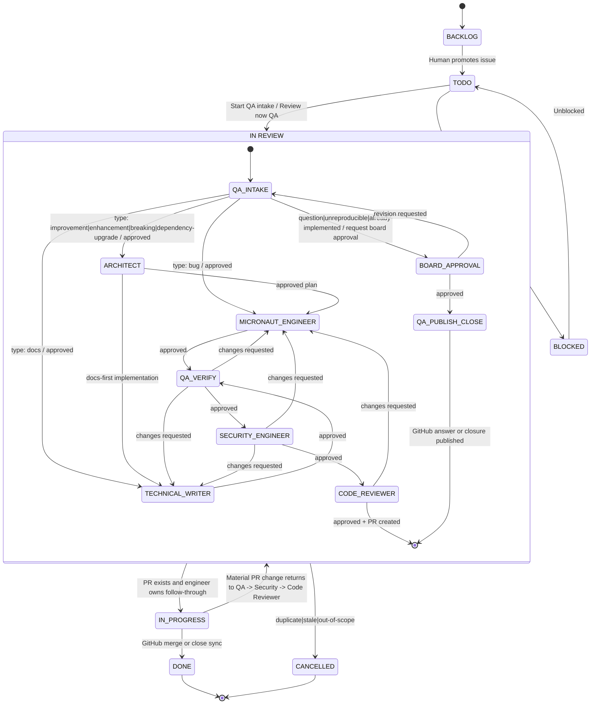
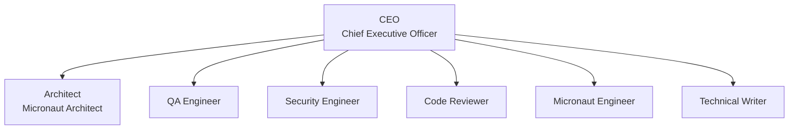

# Micronaut Agent Company

Micronaut Agent Company is an importable Agent Companies package for Paperclip. It is built for a subset of related repositories in the `micronaut-projects` GitHub organization and is optimized for the long-running maintenance problem: keep the issue and PR inbox empty without sacrificing code quality, compatibility, security, or documentation quality.

It combines company-local governance skills with referenced maintainer skills pinned to `micronaut-project-template`, so the agents reuse upstream Micronaut coding, docs, and Gradle guidance instead of vendoring those instructions here.

This package assumes the [paperclip-github-plugin](https://github.com/alvarosanchez/paperclip-github-plugin) is installed in the target Paperclip instance and is responsible for syncing GitHub issues and PRs into Paperclip and exposing GitHub operations as agent tools.

## Quick Start

Import the company package into Paperclip directly from GitHub:

```bash
npx paperclipai company import https://github.com/alvarosanchez/micronaut-agent-company
```

## Runtime Defaults

All agents are configured to use `codex_local` with `gpt-5.4` and live web search enabled.

- Architect: `high`
- Security Engineer: `high`
- QA Engineer: `high`
- Code Reviewer: `high`
- CEO: `medium`
- Micronaut Engineer: `medium`
- Technical Writer: `medium`

## Paperclip Agent Icons

Each agent defines a Paperclip-specific icon hint under `metadata.paperclip.agentIcon` in its `AGENTS.md` frontmatter. `paperclip-agent-companies-plugin` should read that value during import and apply it to the created Paperclip agent; if an icon id is unknown, the plugin should fall back to its default icon instead of failing the import.

| Agent | `metadata.paperclip.agentIcon` |
| --- | --- |
| CEO | `crown` |
| Architect | `telescope` |
| QA Engineer | `eye` |
| Security Engineer | `shield` |
| Code Reviewer | `search` |
| Micronaut Engineer | `hammer` |
| Technical Writer | `message-square` |

## Workflow

The company uses a deliberate maintenance pipeline instead of a generic "everyone codes" setup:

1. The sync plugin creates new GitHub issues in Paperclip in `BACKLOG`.
2. A human reviews backlog items and moves actionable ones to `TODO`.
3. **QA Engineer** handles the intake stage: repository-local GitHub deduplication, `type:` labeling, and downstream execution-policy setup.
4. **Architect** handles the planning stage for `type: improvement`, `type: enhancement`, `type: breaking`, and `type: dependency-upgrade` work, including the exact Micronaut organization project that matches the intended release.
5. **Micronaut Engineer** or **Technical Writer** handles the implementation stage using local git CLI only.
6. **QA Engineer** handles the verification stage against the reproducer or plan.
7. **Security Engineer** handles the security stage for source, build, CI/CD, dependency, and secure-default risk.
8. **Code Reviewer** handles the final review stage and creates the GitHub PR directly when the work is approved, linking it to the chosen Micronaut organization project.
9. **Micronaut Engineer** owns PR follow-through after PR creation: keep CI green, address Sonar Quality Gate issues, resolve all review threads, and keep the chosen project link correct if the PR is retargeted, preserving it unless the Architect explicitly retargets the release.
10. The board or other Micronaut maintainers merge the PR or cut the release. The sync plugin eventually marks the Paperclip item `DONE`.

The workflow is driven by Paperclip review stages plus linked Paperclip approvals. Agents act only when they are the current execution stage participant, resolve stages with `approved` or `changes_requested`, and use linked Paperclip approvals when a human decision is required. Assignee flips and Paperclip handoff comments are not the routing mechanism.

Recommended live execution-policy stage layouts:

- `type: bug`: `QA intake -> Micronaut Engineer -> QA verification -> Security Engineer -> Code Reviewer`
- `type: docs`: `QA intake -> Technical Writer -> QA verification -> Security Engineer -> Code Reviewer`
- `type: improvement`, `type: enhancement`, `type: breaking`, `type: dependency-upgrade`: `QA intake -> Architect -> Micronaut Engineer or Technical Writer -> QA verification -> Security Engineer -> Code Reviewer`
- `type: question`, unreproducible bug closure, or already-implemented closure: `QA intake -> linked board approval -> QA publish/close`

## Reviewer Wakeups And Approvals

- Deduplication during QA intake must search GitHub issues in the same synced repository through the GitHub sync plugin. Paperclip issue search is not the deduplication source of truth for delivery work.
- Adding a Paperclip reviewer does not automatically wake that reviewer. After a stage becomes active and you want the next reviewer to act immediately, invoke that agent heartbeat explicitly with the documented `POST /api/agents/{agentId}/heartbeat/invoke` endpoint, the equivalent runtime wake endpoint exposed by your installed build, or the UI's `Review now` action.
- Paperclip review stages can have multiple participants. When you expect more than one reviewer to look at the active stage, invoke each reviewer explicitly after the stage becomes active.
- This package models required gates as separate sequential stages. That is intentional: the installed `paperclipai@2026.416.0` runtime in this repository still exposes `approvalsNeeded: 1` for execution stages, so a single multi-participant stage should not be treated as a guaranteed unanimous gate.
- Human governance uses linked Paperclip approvals. Those approvals are separate records linked to issues, with their own lifecycle and decision notes, and they are the package's source of truth for board approval.

## Issue Lifecycle



After every `approved` transition, explicitly invoke the next reviewer heartbeat if you expect them to act now. For the question and approved-closure path, the linked board approval replaces the next review stage until a human resolves it.

In addition to the synced GitHub work queue, the package includes one bootstrap internal issue plus two weekly internal routines under `company-operations`. The bootstrap issue, **Verify Imported Company Instance**, imports in `TODO` on the CEO queue so the imported entity set can be checked before normal operations begin. The routines create ongoing internal Paperclip work items that help keep the company healthy; they do not replace the synced GitHub issues and PRs that remain the real delivery backlog. The routines import paused by default so maintainers can finish GitHub sync and any `.company-runtime/` setup before enabling them.

Immediate closure outcomes such as duplicate, stale, out-of-scope, or already-implemented issues are handled during QA triage as documented closure dispositions rather than new `type:` labels. For already-implemented reports, QA must capture the supporting version, PR, release, or documentation evidence and wait for the required Paperclip board approval before posting the GitHub explanation and closing the issue.

## Issue Types

| Label | Meaning | Default Route |
| --- | --- | --- |
| `type: breaking` | Breaking change that requires a new major line and explicit Architect approval | Architect |
| `type: enhancement` | New feature that belongs on the next minor line | Architect |
| `type: improvement` | Small non-breaking product change that fits a patch release | Architect |
| `type: docs` | Documentation-only change | Technical Writer |
| `type: dependency-upgrade` | Squad-originated version bump, excluding Dependabot | Architect |
| `type: bug` | Reproducible bug fix | Micronaut Engineer |
| `type: question` | Question that needs a board-approved answer proposal | QA Engineer |

## Governance

- The board is intentionally not modeled as an agent role. It remains an external human governance layer.
- Board approval always means an explicit human Paperclip approval linked to the relevant issue or proposal, not a free-form comment.
- Git operations must use the local git CLI.
- GitHub operations must use the GitHub agent tools provided by the sync plugin.
- The implementation loop is always `Engineering or Writing -> QA -> Security Engineer -> Code Reviewer`.
- `Code Reviewer` creates the PR after QA and Security Engineer sign-off, but only the board or other Micronaut maintainers may merge or cut releases.
- Passing QA, Security, or Code Review is not a terminal state for a synced GitHub issue by itself. Agents must verify that the issue execution state advanced to the correct next stage before they stop.
- If the next stage should act immediately, agents must explicitly invoke the next reviewer heartbeat. Adding a reviewer alone is not enough.
- If you need all required reviewers to sign off, model them as separate sequential stages instead of a single multi-participant execution stage.
- Every PR must include a closing keyword such as `Fixes #123`, must carry one of the `type:` labels above, and must be linked to exactly one Micronaut organization project representing the earliest Micronaut Platform release that can consume the targeted module version.
- If multiple organization projects are plausible, if no matching project exists yet, or if the available GitHub tooling cannot apply the project link, agents must escalate instead of opening an unlinked PR.
- Imported company instances treat package-owned defaults as immutable in place; reusable default improvements should be promoted by the CEO through a PR to `alvarosanchez/micronaut-agent-company`.

## Work Surface

- The GitHub sync plugin creates one Paperclip project per synced repository.
- Synced GitHub issues and PRs are the actual work items for the company.
- This package intentionally ships no starter delivery backlog.
- It does include one lightweight internal project, `company-operations`, whose bootstrap CEO verification task imports as a `TODO` issue and whose two recurring tasks import as paused Paperclip routines for security posture reviews and CEO self-improvement.
- Paperclip issue blockers and execution policies for synced GitHub delivery work belong in the live Paperclip instance or sync/plugin layer, because those issues are created after import rather than authored inside this package. Configure those live issues with review and approval stages that match this package's workflow.
- Use linked Paperclip approvals for board governance. Do not depend on free-form comments or on undocumented approver semantics inside execution stages.
- Use `.company-runtime/shared.md` or `.company-runtime/projects/<project-slug>.md` for supplemental release, CI, docs, and maintainer-convention notes that are not already encoded in the sync plugin configuration.

## Internal Bootstrap Issue

| Issue | Assignee | Initial Status | Purpose |
| --- | --- | --- | --- |
| `Verify Imported Company Instance` | CEO | `TODO` | Audit the imported company entities before normal operations begin and record any mismatch as either local overlay follow-up or a package PR candidate |

## Internal Routines

| Routine | Assignee | Schedule | Purpose |
| --- | --- | --- | --- |
| `Weekly Security Deep Scan` | Security Engineer | Mondays at 09:00 `Europe/Madrid` | Proactively inspect recent code, dependencies, build logic, CI/CD, release automation, and docs for security risk |
| `Weekly CEO Self-Improvement` | CEO | Fridays at 15:00 `Europe/Madrid` | Review recent executions, audit the imported company skill inventory, keep repo-level instruction hygiene healthy, and promote reusable company learnings through package PRs |

These routines import paused by default. Enable them only after GitHub sync is healthy and any `.company-runtime/` overlays you need are in place.

## Reimport-Safe Runtime Overlays And Package Evolution

This package is designed to be reimported repeatedly as it evolves. To avoid package drift, agents should treat the package-owned files under `agents/`, `skills/`, `projects/`, `tasks/`, `teams/`, plus `COMPANY.md`, `README.md`, and `.paperclip.yaml`, as published defaults inside imported company instances.

For local, additive guidance that should survive reimports, agents may read and maintain optional sidecar files in `.company-runtime/` at the workspace root. This is the repo-local equivalent of additive extension instructions in a live Paperclip company:

```text
.company-runtime/
  shared.md
  agents/
    ceo.md
    security-engineer.md
  projects/
    company-operations.md
```

These files are additive, optional, and intentionally outside the portable package surface. If the current workspace is a managed Micronaut repository rather than this company package, repo-level `AGENTS.md` files remain valid product artifacts and may still be maintained when the active task or routine calls for it.

When a learning should improve the default behavior of future imports, the CEO should promote it through a PR to `https://github.com/alvarosanchez/micronaut-agent-company` instead of baking it into local overlays or mutating an imported company instance in place.

## GitHub Sync Agent Tools

The GitHub sync plugin exposes these GitHub workflow tools to agents, and this company expects agents to use them explicitly instead of `gh` or browser actions:

- Intake and deduplication: `search_repository_items`
- Issue context: `get_issue`, `list_issue_comments`
- Issue mutation: `update_issue`, `add_issue_comment`
- PR creation and state: `create_pull_request`, `get_pull_request`, `update_pull_request`
- PR inspection: `list_pull_request_files`, `get_pull_request_checks`, `list_pull_request_review_threads`
- Review-thread actions: `reply_to_review_thread`, `resolve_review_thread`, `unresolve_review_thread`
- Reviewer routing: `request_pull_request_reviewers`

Use `paperclipIssueId` whenever work starts from a synced Paperclip issue so the plugin can infer the linked GitHub issue or PR and repository. When posting a GitHub issue comment or review-thread reply, pass only the human-facing body and include `llmModel: gpt-5.4`; the plugin appends the required AI-authorship footer automatically.

## Paperclip Runtime APIs

Some workflow actions are Paperclip runtime concerns rather than GitHub sync concerns:

- Reviewer wakeups: use the documented `POST /api/agents/{agentId}/heartbeat/invoke` endpoint, the equivalent runtime wake endpoint exposed by your installed build, or the UI's `Review now` action after activating the next review stage.
- Linked board approvals: create, inspect, approve, reject, request revision, resubmit, and comment on approvals through the Paperclip approvals API.
- Approval lifecycle: linked approvals are separate records from issue review stages. They start pending, carry their own decision note history, and are the package's source of truth for board approval.

## Org Chart



## Role Details

| Agent | Title | Reports To | Primary Responsibility |
| --- | --- | --- | --- |
| CEO | Chief Executive Officer | `null` | Queue health, board-approval visibility, repo-cluster scope, package-evolution routing, escalation |
| Architect | Micronaut Architect | `ceo` | Release targeting, implementation plans, branch strategy, breaking-change approval |
| QA Engineer | QA Engineer | `ceo` | Intake gate, deduplication, label classification, reproducer validation, final QA sign-off |
| Security Engineer | Security Engineer | `ceo` | Security review across source code, dependencies, build scripts, CI/CD, secure defaults, and security-sensitive docs |
| Code Reviewer | Code Reviewer | `ceo` | Structural review, PR creation, maintainer-facing quality and DX gate |
| Micronaut Engineer | Micronaut Engineer | `ceo` | Code implementation, reproducer fixes, PR-cycle execution |
| Technical Writer | Technical Writer | `ceo` | Docs-only implementation, migration notes, guide and reference quality |

## Local Company Skills

| Skill | Purpose |
| --- | --- |
| `company-package-evolution` | CEO decision framework for keeping local learnings additive versus promoting reusable defaults into PRs against this company package's source repo |
| `micronaut-repo-operations` | Shared operating rules for lifecycle state, labels, SemVer targeting, PR rules, tool boundaries, internal routines, and reimport-safe runtime overlays |
| `micronaut-quality-gates` | Common definition of done across triage, planning, implementation, QA, security review, code review, and PR follow-through |
| `micronaut-security-review` | Security review checklist for Micronaut source code, dependencies, build logic, CI/CD, release automation, secure defaults, and proactive deep scans |

## Referenced Upstream Skills

These skills are included as referenced skills pinned to `micronaut-projects/micronaut-project-template` rather than copied into this repository:

| Skill | Assigned To | Purpose |
| --- | --- | --- |
| `coding` | Architect, Micronaut Engineer, Security Engineer, Code Reviewer | Micronaut maintainer guidance for Java implementation, API evolution, and maintainer-grade verification |
| `docs` | Architect, Micronaut Engineer, Technical Writer, Code Reviewer | Micronaut guide-authoring conventions for Asciidoctor, `toc.yml`, macros, and docs validation |
| `gradle` | Architect, Micronaut Engineer, QA Engineer, Security Engineer, Code Reviewer | Micronaut maintainer Gradle workflows, compatibility checks, catalog management, and build diagnostics |
| `agent-md-refactor` | CEO, Technical Writer | Progressive-disclosure refactoring for repo-level and local runtime instruction files so guidance stays compact, linked, and reimport-safe |
| `skill-creator` | Architect | Agent-agnostic skill authoring guidance used when the company evolves its own shared skills |

## First Run

1. Import the company into Paperclip.
2. Configure the GitHub sync plugin so the target repositories are synced, one Paperclip project is created per repository, new issues land in `BACKLOG`, the required `type:` labels exist in GitHub, and live synced issues receive the correct Paperclip review and approval stages for this workflow.
3. If you want local, additive runtime guidance that survives package reimports, create `.company-runtime/shared.md` and any role- or project-specific overlay files you need. Keep that guidance out of the package-owned core files unless you are intentionally publishing a new package version through a PR to `alvarosanchez/micronaut-agent-company`.
4. Put any supplemental facts the agents will need during execution into `.company-runtime/shared.md` or `.company-runtime/projects/<project-slug>.md`, such as release-line rules, CI commands, Sonar expectations, docs layout notes, and maintainer preferences.
5. Let the sync plugin import the live GitHub issues and PRs. Those imported items are the company backlog and active work queue.
6. Expect Paperclip to import `Verify Imported Company Instance` as a `TODO` issue for the **CEO**, plus the `company-operations` recurring tasks as paused internal routines for the **Security Engineer** and **CEO**. Use the bootstrap issue to verify the imported entities before you enable the routines.
7. Use the imported `micronaut-repo-operations` and `micronaut-quality-gates` skills as the operational source of truth when adjusting local company policy.

## Import

Import the company package into Paperclip:

```bash
npx paperclipai company import https://github.com/alvarosanchez/micronaut-agent-company
```

## Release

Every push to `main` now triggers the `Release Company` workflow. The workflow serializes concurrent runs, skips stale ones, bumps the package to the next patch version, verifies the import, commits the updated `COMPANY.md`, `package.json`, and `package-lock.json`, then tags that commit as `vX.Y.Z` and publishes a GitHub release.

You can still run `Release Company` manually from the GitHub Actions UI:

- Set `release_tag` to any valid Git tag string to publish a GitHub release for the current `main` head.
- If `release_tag` is a SemVer value such as `v1.2.3` or `1.2.3`, the workflow also syncs the company version files to that version before publishing.
- Set `release_title` when you want a free-form GitHub release title that differs from the tag.

## Validation

Run the end-to-end import verifier locally with Node 22:

```bash
npm run test:node22
```

This boots an isolated Paperclip instance, imports the company, verifies the created company, agents, skills, and exported extension through the Paperclip API, then tears the instance down.

## References

- [Agent Companies specification](https://agentcompanies.io/specification)
- [Paperclip](https://github.com/paperclipai/paperclip)
- [paperclipai/companies](https://github.com/paperclipai/companies)
- [micronaut-project-template skills](https://github.com/micronaut-projects/micronaut-project-template/tree/master/.agents/skills)
