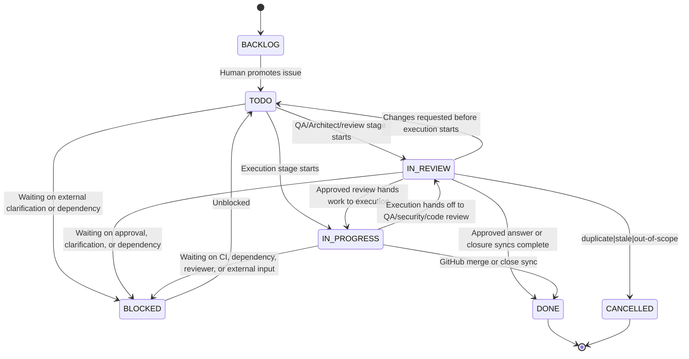
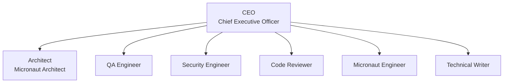

# Micronaut Agent Company

Micronaut Agent Company is an importable Agent Companies template package for Paperclip. It is built for a subset of related repositories in the `micronaut-projects` GitHub organization and is optimized for the long-running maintenance problem: keep the issue and PR inbox empty without sacrificing code quality, compatibility, security, or documentation quality.

It combines company-local governance skills with referenced maintainer skills pinned to `micronaut-project-template`, so the agents reuse upstream Micronaut coding, docs, and Gradle guidance instead of vendoring those instructions here.

This package assumes the [paperclip-github-plugin](https://github.com/alvarosanchez/paperclip-github-plugin) is installed in the target Paperclip instance and is responsible for syncing GitHub issues and PRs into Paperclip and exposing GitHub operations as agent tools.

## Quick Start

Import the company package into Paperclip directly from GitHub:

```bash
npx paperclipai company import https://github.com/alvarosanchez/micronaut-agent-company
```

## Runtime Defaults

All agents are configured to use `codex_local` with `gpt-5.4` and live web search enabled.

- Architect: `high`
- Security Engineer: `high`
- QA Engineer: `high`
- Code Reviewer: `high`
- CEO: `medium`
- Micronaut Engineer: `medium`
- Technical Writer: `medium`

## Paperclip Agent Icons

Each agent defines a Paperclip-specific icon hint under `metadata.paperclip.agentIcon` in its `AGENTS.md` frontmatter. `paperclip-agent-companies-plugin` should read that value during import and apply it to the created Paperclip agent; if an icon id is unknown, the plugin should fall back to its default icon instead of failing the import.

| Agent | `metadata.paperclip.agentIcon` |
| --- | --- |
| CEO | `crown` |
| Architect | `telescope` |
| QA Engineer | `eye` |
| Security Engineer | `shield` |
| Code Reviewer | `search` |
| Micronaut Engineer | `hammer` |
| Technical Writer | `message-square` |

## Workflow

The company uses a deliberate maintenance pipeline instead of a generic "everyone codes" setup:

1. The sync plugin creates new GitHub issues in Paperclip in `BACKLOG`.
2. A human reviews backlog items and moves actionable ones to `TODO`.
3. **QA Engineer** handles the intake stage: repository-local GitHub deduplication, `type:` labeling, default-branch and release-fact gathering, SemVer targeting, best-fit Micronaut organization-project selection, downstream execution-policy setup, and any first-pass evaluation of an already-linked PR.
4. **Architect** handles the planning stage for `type: improvement`, `type: enhancement`, `type: breaking`, and `type: dependency-upgrade` work, consuming QA's release-targeting facts and locking the implementation plan.
5. **Micronaut Engineer** or **Technical Writer** handles the implementation stage using local git CLI only.
6. **QA Engineer** handles the verification stage against the reproducer or plan.
7. **Security Engineer** handles the security stage for source, build, CI/CD, dependency, and secure-default risk.
8. **Code Reviewer** handles the final review stage and creates the GitHub PR directly when the work is approved, or verifies an acceptable already-open PR, linking the surviving PR to the Micronaut organization project chosen during QA intake when that project exists and GitHub tooling can apply it.
9. **Micronaut Engineer** owns PR follow-through after PR creation: keep CI green, address Sonar Quality Gate issues, resolve all review threads, and keep any chosen project link correct if the PR is retargeted, preserving it unless an upstream stage explicitly retargets the release.
10. The board or other Micronaut maintainers merge the PR or cut the release. The sync plugin eventually marks the Paperclip item `DONE`.

The workflow is driven by Paperclip execution stages for active engineering or writing work, review stages for sign-off and approval points, and linked Paperclip approvals for human governance. Micronaut Engineer, Technical Writer, and post-PR follow-through should run as checkout-backed execution stages that drive agent-owned `IN_PROGRESS`. QA intake or verification, Architect planning, Security Engineer review, and Code Reviewer sign-off should run as review stages that surface `IN_REVIEW` while the next move belongs to a reviewer or approver.

Agents act only when they are the current execution stage participant, resolve stages with `approved`, `changes_requested`, or `request_board_approval` when a linked human decision must gate the next public action, and use linked Paperclip approvals when a human decision is required. For synced GitHub delivery work, `approved` only advances the workflow; it does not mean the item is complete, and agents must not mark the Paperclip issue `DONE` themselves. Closing a synced GitHub issue also does not mean manually closing the Paperclip item; the GitHub sync plugin closes it on the next sync. Assignee flips and Paperclip handoff comments are not the routing mechanism.

Imported issues may already have a linked PR from an external contributor. QA evaluates that PR during intake. If the linked PR is good enough to salvage, it stays on the normal gates and the later engineering, QA, security, and code-review stages bring that existing PR to the same mergeable condition expected of an agent-created PR. If the linked PR is stale, retargeted incorrectly, or otherwise needs a replacement instead of incremental follow-through, QA leaves that contributor PR open, records that it is not the implementation vehicle, and routes the issue itself through the normal engineering pipeline toward a separate maintainer-owned PR.

Recommended live execution-policy stage layouts:

- `type: bug`: `QA intake review -> Micronaut Engineer execution -> QA verification review -> Security Engineer review -> Code Reviewer review`
- `type: docs`: `QA intake review -> Technical Writer execution -> QA verification review -> Security Engineer review -> Code Reviewer review`
- `type: improvement`, `type: enhancement`, `type: breaking`, `type: dependency-upgrade`: `QA intake review -> Architect review -> Micronaut Engineer or Technical Writer execution -> QA verification review -> Security Engineer review -> Code Reviewer review`
- `type: question`, clarification wait paths, unreproducible closures, duplicate closures, and already-implemented closures: `QA intake`, with QA publishing the GitHub answer or closure directly and waiting for sync

## Reviewer Wakeups And Approvals

- Deduplication during QA intake must search GitHub issues in the same synced repository through the GitHub sync plugin. Paperclip issue search is not the deduplication source of truth for delivery work.
- Agent-owned `TODO` is dispatch state, not silent parking. If an issue stays assigned in `TODO`, make sure a wake path exists or that a prior successful run intentionally left it there.
- Active engineering or writing work should move through checkout-backed execution stages. Use `POST /api/issues/{issueId}/checkout` before agent-owned `IN_PROGRESS` work and `POST /api/issues/{issueId}/release` when intentionally handing the issue back to review or another waiting state.
- Adding a Paperclip reviewer does not automatically wake that reviewer. After a stage becomes active and you want the next reviewer to act immediately, invoke that agent heartbeat explicitly with the documented `POST /api/agents/{agentId}/heartbeat/invoke` endpoint, the equivalent runtime wake endpoint exposed by your installed build, or the UI's `Review now` action.
- Paperclip review stages can have multiple participants. When you expect more than one reviewer to look at the active stage, invoke each reviewer explicitly after the stage becomes active.
- This package models required gates as separate sequential stages. That is intentional: the installed `paperclipai@2026.416.0` runtime in this repository still exposes `approvalsNeeded: 1` for execution stages, so a single multi-participant stage should not be treated as a guaranteed unanimous gate.
- Human governance uses linked Paperclip approvals. Those approvals are separate records linked to issues, with their own lifecycle and decision notes, and they are the package's source of truth for board approval.
- Routine QA GitHub issue answers and closure paths for `type: question`, `status: awaiting feedback`, `closed: question`, `closed: cannot reproduce`, `closed: duplicate`, and evidence-backed `already-implemented` closures do not need board approval.
- When a linked board approval is asking permission to post a maintainer-visible GitHub comment, or proposes a GitHub action with a maintainer-visible `commentBody`, the approval request must put the exact proposed comment body in `recommendedAction` so the default approval card shows the literal public text without expanding hidden fields such as `proposedCommentBody` or `proposedGithubAction.commentBody`.
- If a live Paperclip issue truly cannot continue until another issue changes state, configure blockers in the live Paperclip instance. Parent/sub-issue links are only structural context and do not replace blocker-driven waiting.

## Issue Lifecycle



After every `approved` transition, explicitly invoke the next reviewer heartbeat if you expect them to act now.

When a Paperclip issue is structurally broken into child issues, treat that as rollup context only. If the parent really cannot continue until one of those children changes state, configure blockers in the live instance; `parentId` alone is not a dependency edge and will not replace blocker-driven wakeups. `BLOCKED` is the right resting state when the issue is waiting on another issue, a human decision, or an external dependency.

For PR-based delivery work, a synced Paperclip item remains open until the linked PR merges and the GitHub sync plugin reflects that merge back into Paperclip. For QA-published answers or closures, the terminal Paperclip state depends on the closure disposition after the GitHub action actually syncs back: published answers and closures such as `type: question` plus `closed: question`, timed-out `status: awaiting feedback`, `closed: cannot reproduce`, or an evidence-backed already-implemented closure become `DONE`, while disposition-based closures such as `closed: duplicate`, stale, or out-of-scope become `CANCELLED`. Agents should never treat a successful QA, Security Engineer, or Code Reviewer stage by itself as permission to close the Paperclip item manually.

In addition to the synced GitHub work queue, the package includes one bootstrap internal issue plus two recurring internal routines under `company-operations`: a weekly security scan and a daily CEO self-improvement review. The bootstrap issue, **Verify Imported Company Instance**, imports in `TODO` on the CEO queue so the imported entity set can be checked before normal operations begin. The routines create ongoing internal Paperclip work items that help keep the company healthy; they do not replace the synced GitHub issues and PRs that remain the real delivery backlog. The routines import active by default so those recurring maintenance checks start automatically after import.

Immediate closure outcomes such as duplicate, stale, out-of-scope, or already-implemented issues are handled during QA triage as documented closure dispositions rather than new `type:` labels. QA can answer confident questions directly on GitHub with `type: question` and `closed: question`, request clarification with `status: awaiting feedback`, and close issues that stay awaiting feedback for more than 30 days with `closed: question`. Unreproducible issues can be closed by QA with `closed: cannot reproduce`. Duplicate issues can be closed by QA with `closed: duplicate` and a duplicate link to the superseding GitHub issue. Every GitHub issue closure by QA must include a detailed comment that explains the closure clearly enough for the reporter. For already-implemented reports, QA can close the issue directly without board approval once the closure comment cites the exact version, PR, release, or documentation evidence that shows the requested work already exists.

When the synced issue already has a linked contributor PR, that PR should never be closed just because it is not good enough. If significant changes would effectively replace the contributor PR, QA should leave the contributor PR open, keep the issue on the normal route, and let later stages create a separate maintainer-owned PR for the replacement work.

## Issue Types

| Label | Meaning | Default Route |
| --- | --- | --- |
| `type: breaking` | Breaking change that would require a major module version and explicit Architect approval | Architect |
| `type: enhancement` | New non-breaking feature work that typically requires a minor module version | Architect |
| `type: improvement` | Small non-breaking product change that should fit the current default branch when that branch can still take improvements | Architect |
| `type: docs` | Documentation-only change | Technical Writer |
| `type: dependency-upgrade` | Squad-originated version bump whose routing depends on compatibility impact, excluding Dependabot | Architect |
| `type: bug` | Reproducible bug fix that should fit the current default branch when that branch can still take bugfixes | Micronaut Engineer |
| `type: question` | Question QA can answer directly or send back for clarification | QA Engineer |

## Governance

- The board is intentionally not modeled as an agent role. It remains an external human governance layer.
- Board approval always means an explicit human Paperclip approval linked to the relevant issue or proposal, not a free-form comment.
- QA may answer confident questions directly on GitHub with `type: question` and `closed: question`, request clarification with `status: awaiting feedback`, and close timed-out clarification, unreproducible, duplicate, or evidence-backed already-implemented issues without separate board approval when those paths are well documented.
- Approval requests for maintainer-visible GitHub comments, including action payloads with `commentBody`, must put the exact proposed comment body in `recommendedAction` so the board can approve the literal public response from the default Paperclip view.
- Git operations must use the local git CLI.
- GitHub operations must use the GitHub agent tools provided by the sync plugin.
- QA intake owns repository release targeting: identify the actual current default branch, the latest stable non-pre-release release, the next repository release implied by that branch, whether the branch has already shipped, and the recommended Micronaut organization project for the eventual PR.
- When QA lists Micronaut organization projects, the candidate set should be the open, public Micronaut organization projects (`is:open is:public`).
- Trust the repository's actual current default branch instead of assuming a generic Micronaut branch strategy.
- PRs should target the current default branch only when that branch's current release state permits the issue's SemVer impact.
- If the current default branch has never been released, it may take `type: bug`, `type: improvement`, `type: enhancement`, and docs, CI, or build-only changes. An unreleased new major default branch may also take `type: breaking` work with the required approvals.
- If the current default branch has already been released, it may take `type: bug`, `type: improvement`, and docs, CI, or build-only changes. `type: enhancement` and `type: breaking` stay off that branch unless a human-approved release-policy exception exists.
- If the issue's SemVer impact does not fit the current default branch, QA records that mismatch during triage and routes the issue through planning or governance instead of inventing a non-default target branch.
- The implementation loop is always `Engineering or Writing -> QA -> Security Engineer -> Code Reviewer`.
- `Code Reviewer` creates the PR when no acceptable PR exists yet, or verifies the acceptable already-open PR after QA and Security Engineer sign-off, but only the board or other Micronaut maintainers may merge or cut releases.
- `Code Reviewer` must not resolve PR-based delivery work as `approved` unless, by the end of that run, a non-draft GitHub PR exists in the correct repository and branch, is readable through the synced GitHub context, and carries the correct issue linkage, closing keyword, and `type:` label. The PR should be linked to the Micronaut organization project chosen during QA intake when that project exists and GitHub tooling can apply it, but missing linkage due to no matching project or tooling gaps does not by itself block an `approved` outcome.
- Passing QA, Security, or Code Review is not a terminal state for a synced GitHub issue by itself. Agents must verify that the issue execution state advanced to the correct next stage before they stop.
- For PR-based delivery work, agents never close the synced Paperclip issue themselves. The GitHub sync plugin owns the transition to `DONE` after merge.
- When QA closes a synced GitHub issue directly, the GitHub issue closure syncs back to close the Paperclip item, so QA does not close the Paperclip issue directly.
- If the next stage should act immediately, agents must explicitly invoke the next reviewer heartbeat. Adding a reviewer alone is not enough.
- If you need all required reviewers to sign off, model them as separate sequential stages instead of a single multi-participant execution stage.
- Every PR must include a closing keyword such as `Fixes #123`, must carry one of the `type:` labels above, and should be linked to the Micronaut organization project chosen during QA intake, representing the best-fit Micronaut Platform release that can first consume the repository's next module release.
- If that best-fit organization-project choice is ambiguous, including major-version upgrades that may or may not fit the next Platform minor board cleanly, agents should keep the chosen project and record the ambiguity in the stage artifact or PR summary instead of dropping the link.
- If no matching organization project exists yet, or if the available GitHub tooling cannot apply the project link, agents should record the gap and continue instead of escalating solely for that reason.
- Imported company instances treat package-owned defaults as immutable in place; reusable default improvements should be promoted by the CEO through a PR to `alvarosanchez/micronaut-agent-company`.

## Work Surface

- The GitHub sync plugin creates one Paperclip project per synced repository.
- Synced GitHub issues and PRs are the actual work items for the company.
- This package intentionally ships no starter delivery backlog.
- It does include one lightweight internal project, `company-operations`, whose bootstrap CEO verification task imports as a `TODO` issue and whose two recurring tasks import as active Paperclip routines for security posture reviews and CEO self-improvement.
- Paperclip issue blockers and execution policies for synced GitHub delivery work belong in the live Paperclip instance or sync/plugin layer, because those issues are created after import rather than authored inside this package. Configure those live issues with review and approval stages that match this package's workflow.
- Use linked Paperclip approvals for board governance. Do not depend on free-form comments or on undocumented approver semantics inside execution stages.
- Use `.company-runtime/shared.md` or `.company-runtime/projects/<project-slug>.md` for supplemental release, CI, docs, and maintainer-convention notes that are not already encoded in the sync plugin configuration.

## Internal Bootstrap Issue

| Issue | Assignee | Initial Status | Purpose |
| --- | --- | --- | --- |
| `Verify Imported Company Instance` | CEO | `TODO` | Audit the imported company entities before normal operations begin and record any mismatch as either local overlay follow-up or a package PR candidate |

## Internal Routines

| Routine | Assignee | Schedule | Purpose |
| --- | --- | --- | --- |
| `Weekly Security Deep Scan` | Security Engineer | Mondays at 09:00 `Europe/Madrid` | Proactively inspect recent code, dependencies, build logic, CI/CD, release automation, and docs for security risk |
| `Daily CEO Self-Improvement` | CEO | Every day at 15:00 `Europe/Madrid` | Review recent executions, audit the imported company skill inventory, keep repo-level instruction hygiene healthy, and promote reusable company learnings through package PRs |

These routines import active by default.

The CEO routine should not end with a naked proposal list. For each high-signal skill or package change, the CEO should either implement the change now, open or update a package PR, or create a linked board approval request that authorizes a specific next action. If the linked approval already exists and is approved, the CEO should implement the change in the same run instead of re-reporting it as a proposal.

Paperclip's system skills `paperclip`, `paperclip-create-agent`, `paperclip-create-plugin`, and `para-memory-files` are bundled with Paperclip and cannot be edited from this package. When the company needs better examples for those capabilities, add company-owned guidance or a company-owned skill here instead.

## Reimport-Safe Runtime Overlays And Package Evolution

This package is designed to be reimported repeatedly as it evolves. To avoid package drift, agents should treat the package-owned files under `agents/`, `skills/`, `projects/`, `tasks/`, `teams/`, plus `COMPANY.md`, `README.md`, and `.paperclip.yaml`, as published defaults inside imported company instances.

For local, additive guidance that should survive reimports, agents may read and maintain optional sidecar files in `.company-runtime/` at the workspace root. A `.company-runtime/` overlay is just an optional local sidecar directory next to the imported company. It is not part of the published package, and if the folder is absent then no local overlay is active. This is the repo-local equivalent of additive extension instructions in a live Paperclip company:

```text
.company-runtime/
  shared.md
  agents/
    ceo.md
    security-engineer.md
  projects/
    company-operations.md
```

These files are additive, optional, and intentionally outside the portable package surface. If the current workspace is a managed Micronaut repository rather than this company package, repo-level `AGENTS.md` files remain valid product artifacts and may still be maintained when the active task or routine calls for it.

When a learning should improve the default behavior of future imports, the CEO should promote it through a PR to `https://github.com/alvarosanchez/micronaut-agent-company` instead of baking it into local overlays or mutating an imported company instance in place.

## GitHub Sync Agent Tools

The GitHub sync plugin exposes these GitHub workflow tools to agents. Use the exact runtime tool IDs below, not shorthand names. Paperclip namespaces plugin tools as `<pluginId>:<toolName>`, and this plugin's manifest id is `paperclip-github-plugin`:

- Intake and deduplication: `paperclip-github-plugin:search_repository_items`
- Issue context: `paperclip-github-plugin:get_issue`, `paperclip-github-plugin:list_issue_comments`
- Issue mutation: `paperclip-github-plugin:update_issue`, `paperclip-github-plugin:add_issue_comment`
- PR creation and state: `paperclip-github-plugin:create_pull_request`, `paperclip-github-plugin:get_pull_request`, `paperclip-github-plugin:update_pull_request`
- PR inspection: `paperclip-github-plugin:list_pull_request_files`, `paperclip-github-plugin:get_pull_request_checks`, `paperclip-github-plugin:list_pull_request_review_threads`
- Review-thread actions: `paperclip-github-plugin:reply_to_review_thread`, `paperclip-github-plugin:resolve_review_thread`, `paperclip-github-plugin:unresolve_review_thread`
- Reviewer routing: `paperclip-github-plugin:request_pull_request_reviewers`
- Organization project lookup: `paperclip-github-plugin:list_organization_projects` against the open, public Micronaut organization projects (`is:open is:public`)
- PR project association: `paperclip-github-plugin:add_pull_request_to_project`

Use `paperclipIssueId` whenever work starts from a synced Paperclip issue so the plugin can infer the linked GitHub issue or PR and repository. If you publish maintainer-visible GitHub body text directly through `gh` or another `GITHUB_TOKEN`-backed write path, append this exact GitHub-flavored Markdown footer yourself:

```md
---
###### ✨ This message was AI-generated using <exact model id>
```

When you post through the GitHub sync plugin tools, do not add that footer manually; the plugin appends the same footer automatically. For `paperclip-github-plugin:add_issue_comment` and `paperclip-github-plugin:reply_to_review_thread`, pass only the human-facing body and include `llmModel: gpt-5.4`.

## Paperclip Runtime APIs

Some workflow actions are Paperclip runtime concerns rather than GitHub sync concerns. In the current `paperclipai@2026.416.0` build, these are core APIs, not built-in agent-tool IDs:

- Reviewer wakeups: use the documented `POST /api/agents/{agentId}/heartbeat/invoke` endpoint, the equivalent runtime wake endpoint exposed by your installed build, or the UI's `Review now` action after activating the next review stage.
- Active execution checkout: use `POST /api/issues/{issueId}/checkout` before agent-owned work enters `IN_PROGRESS`, and `POST /api/issues/{issueId}/release` when handing it back to review or another waiting state.
- Linked board approvals: create, inspect, approve, reject, request revision, resubmit, and comment on approvals through the Paperclip approvals API.
- Approval lifecycle: linked approvals are separate records from issue review stages. They start pending, carry their own decision note history, and are the package's source of truth for board approval.
- Comment-gating approvals: when the approval is for a maintainer-visible GitHub issue comment or any GitHub action that includes a public `commentBody`, put the exact proposed comment body in `recommendedAction` before asking the board to approve it, and do not hide the only full draft in `proposedCommentBody` or `proposedGithubAction.commentBody`.

## Org Chart



## Role Details

| Agent | Title | Reports To | Primary Responsibility |
| --- | --- | --- | --- |
| CEO | Chief Executive Officer | `null` | Queue health, board-approval visibility, repo-cluster scope, package-evolution routing, escalation |
| Architect | Micronaut Architect | `ceo` | Implementation plans, compatibility framing, release-policy exceptions, breaking-change approval |
| QA Engineer | QA Engineer | `ceo` | Intake gate, deduplication, label classification, release targeting, SemVer/project triage, reproducer validation, final QA sign-off |
| Security Engineer | Security Engineer | `ceo` | Security review across source code, dependencies, build scripts, CI/CD, secure defaults, and security-sensitive docs |
| Code Reviewer | Code Reviewer | `ceo` | Structural review, PR creation, maintainer-facing quality and DX gate |
| Micronaut Engineer | Micronaut Engineer | `ceo` | Code implementation, reproducer fixes, PR-cycle execution |
| Technical Writer | Technical Writer | `ceo` | Docs-only implementation, migration notes, guide and reference quality |

## Local Company Skills

| Skill | Purpose |
| --- | --- |
| `company-package-evolution` | CEO decision framework for keeping local learnings additive versus promoting reusable defaults into PRs against this company package's source repo |
| `micronaut-repo-operations` | Shared operating rules for lifecycle state, labels, SemVer targeting, PR rules, tool boundaries, internal routines, and reimport-safe runtime overlays |
| `micronaut-quality-gates` | Common definition of done across triage, planning, implementation, QA, security review, code review, and PR follow-through |
| `micronaut-security-review` | Security review checklist for Micronaut source code, dependencies, build logic, CI/CD, release automation, secure defaults, and proactive deep scans |

## Referenced Upstream Skills

These skills are included as referenced skills pinned to `micronaut-projects/micronaut-project-template` rather than copied into this repository:

| Skill | Assigned To | Purpose |
| --- | --- | --- |
| `coding` | Architect, Micronaut Engineer, Security Engineer, Code Reviewer | Micronaut maintainer guidance for Java implementation, API evolution, and maintainer-grade verification |
| `docs` | Architect, Micronaut Engineer, Technical Writer, Code Reviewer | Micronaut guide-authoring conventions for Asciidoctor, `toc.yml`, macros, and docs validation |
| `gradle` | Architect, Micronaut Engineer, QA Engineer, Security Engineer, Code Reviewer | Micronaut maintainer Gradle workflows, compatibility checks, catalog management, and build diagnostics |
| `agent-md-refactor` | CEO, Technical Writer | Progressive-disclosure refactoring for repo-level and local runtime instruction files so guidance stays compact, linked, and reimport-safe |
| `skill-creator` | Architect | Agent-agnostic skill authoring guidance used when the company evolves its own shared skills |

## First Run

1. Import the company into Paperclip.
2. Configure the GitHub sync plugin so the target repositories are synced, one Paperclip project is created per repository, new issues land in `BACKLOG`, the required `type:` labels exist in GitHub, and live synced issues receive the correct Paperclip review and approval stages for this workflow.
3. If you want local, additive runtime guidance that survives package reimports, create `.company-runtime/shared.md` and any role- or project-specific overlay files you need. Keep that guidance out of the package-owned core files unless you are intentionally publishing a new package version through a PR to `alvarosanchez/micronaut-agent-company`.
4. Put any supplemental facts the agents will need during execution into `.company-runtime/shared.md` or `.company-runtime/projects/<project-slug>.md`, such as release-line rules, CI commands, Sonar expectations, docs layout notes, and maintainer preferences.
5. Let the sync plugin import the live GitHub issues and PRs. Those imported items are the company backlog and active work queue.
6. Expect Paperclip to import `Verify Imported Company Instance` as a `TODO` issue for the **CEO**, plus the `company-operations` recurring tasks as active internal routines for the **Security Engineer** and **CEO**. Use the bootstrap issue to verify the imported entities while the routines begin their normal schedule.
7. Importing the bootstrap issue does not automatically wake the CEO. After import, explicitly invoke the CEO heartbeat for `Verify Imported Company Instance` with the documented `POST /api/agents/{agentId}/heartbeat/invoke` endpoint, the equivalent runtime wake endpoint exposed by your installed build, or the UI's `Review now` action.
8. Use the imported `micronaut-repo-operations` and `micronaut-quality-gates` skills as the operational source of truth when adjusting local company policy.

## Import

Import the company package into Paperclip:

```bash
npx paperclipai company import https://github.com/alvarosanchez/micronaut-agent-company
```

## Release

Every push to `main` now triggers the `Release Company` workflow. Keep the current released version in `package.json#version`, and keep the next automatic release target in `package.json#nextVersion`. On each push, the workflow serializes concurrent runs, skips stale runs, releases `nextVersion`, verifies the import, commits the updated `COMPANY.md`, `package.json`, and `package-lock.json`, tags that commit as `vX.Y.Z`, publishes the GitHub release, and then leaves `main` pointing at the released version with `nextVersion` advanced to the following patch.

If `package.json#nextVersion` is missing, the workflow falls back to the next patch release automatically. Prefer explicit `nextVersion` bumps in PRs whenever you want the next automatic release to be a new minor or major line.

You can still run `Release Company` manually from the GitHub Actions UI:

- Set `release_tag` to any valid Git tag string to publish a GitHub release for the current `main` head.
- If `release_tag` is a SemVer value such as `v1.2.3` or `1.2.3`, the workflow also syncs the company version files to that release before publishing and updates `package.json#nextVersion` to the following patch.
- Set `release_title` when you want a free-form GitHub release title that differs from the tag.

## Validation

Run the end-to-end import verifier locally with Node 22:

```bash
npm run test:node22
```

This boots an isolated Paperclip instance, imports the company, verifies the created company, agents, skills, and exported extension through the Paperclip API, then tears the instance down.

## References

- [Agent Companies specification](https://agentcompanies.io/specification)
- [Paperclip](https://github.com/paperclipai/paperclip)
- [paperclipai/companies](https://github.com/paperclipai/companies)
- [micronaut-project-template skills](https://github.com/micronaut-projects/micronaut-project-template/tree/master/.agents/skills)
